# Protocol-Governed Human–AI Software Engineering: Autonomy Without Authority

| **Bhash Ganti**
| Independent Researcher, Unaffiliated
| Camas, WA 98607
| United States
| bachipeachy@gmail.com
| ORCID 0009-0007-3810-6520
| Preprint: https://doi.org/10.5281/zenodo.22650863

## Abstract

Autonomous agents can now perform substantial portions of the software-engineering lifecycle, yet conventional lifecycles rarely make explicit who authorizes the resulting software: repository write access and human review do not by themselves constitute an authorization decision.

This paper reports an empirical realization and evaluation of Protocol-Governed Computing, an architecture in which behaviour is determined during governed construction and sealed into state that execution can realize but cannot amend. We distinguish activity autonomy — who may analyze, design, construct and transform — from authorization authority — who may establish scope, admit a candidate and promote it as the next executable baseline. The question this paper asks is what remains of that authority when an agent performs the activity.

The realization instantiates eight concerns across nine declared phases and seven governed domains at a named revision, spanning construction, admission, promotion, sealing and a traversal-only runtime. In an agent-mediated transformation, a worker executed the exercised transformation path under the supplied realization and harness: it grounded its work in a sealed baseline, derived a design, produced a candidate and realized three artifacts; two baseline artifacts were carried forward with unchanged content identities. Declared refusal paths were exercised by fixtures; scope change and promotion were not attempted.

A risk-directed mutation study found that two demonstrations of required guards failed to discriminate against violations of those guards, while four did. The evidence supports authority separation for the exercised boundaries; unexercised boundaries remain declared rather than observed. The study evaluates an architecture's treatment of agency, not model capability, productivity or software quality.

**Keywords** — protocol-governed computing · human–AI software engineering · authorization ·
governed transformation · evidence adequacy

## 1 Introduction: the agent can act, but who authorizes?

Software engineering has acquired a producer that does not tire. Large language models now draft requirements, derive designs, write implementations, generate tests, author configuration, and open or merge the changes that carry this work into a running system. These activities span the software lifecycle, and each produces a change to executable software.

The human role has shifted accordingly. Where a developer once produced most of what shipped, the same person increasingly directs, evaluates, and approves work produced by AI. **The human approval gate is often treated as the authorization point, where a reviewer determines whether the resulting software may proceed to execution.** That is a description of a conventional lifecycle, not a universal one: deployment, change management and service ownership can each carry an authorization decision independently of code review. The contrast drawn here is against the lifecycle in which review is the point at which the decision is taken. Fig. 1 contrasts the arrangements: producers have changed from developers to human–AI collaboration, while authorization remains concentrated at the review gate.

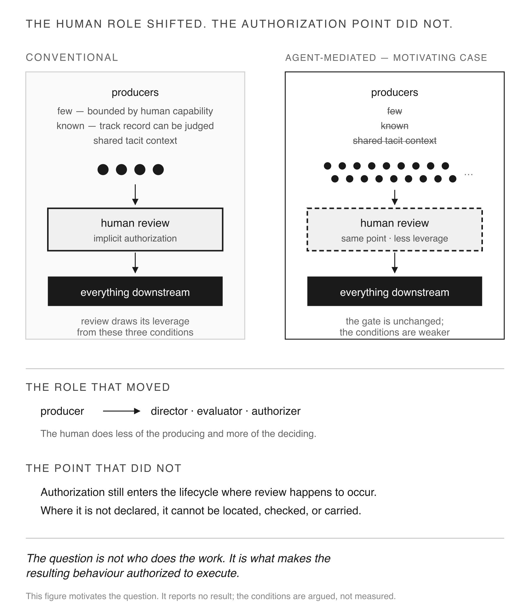{width=6in}

That gate does more work than it appears to. Approval has traditionally carried two decisions: **“this code is correct” and “this code may run.”** When a small, known group produced, reviewed, and operated the system, those decisions naturally traveled together. As roles separate, they become distinct. An agent with repository write access may satisfy every pipeline check while leaving a fundamental question unanswered: **what established that this behavior is permitted?**

**Write access is not authorization.** Human review, tests, signed commits, attested builds, and admission policies can establish provenance, integrity, identity, or conformance. But they do not, by themselves, establish which behaviors the executable system is authorized to realize. Section 2.2 compares these mechanisms with authorization. When a human made every change, that authorization could remain implicit. When an agent makes many changes, it cannot.

The problem extends beyond code construction. Fig. 2 traces it across the lifecycle: deployment determines which configuration runs, version management determines which transitions are allowed, rollback can restore a state that was never re-authorized, and configuration systems can change behavior without stating what those changes permit. Each stage can affect what the software does, but the authorization decision does not necessarily follow the software forward. The conventional response is to add more process—a change board, configuration audit, or release gate—to check for a property that the system itself does not represent. The alternative examined here is to make these decisions explicit as governed artifacts or transformations.

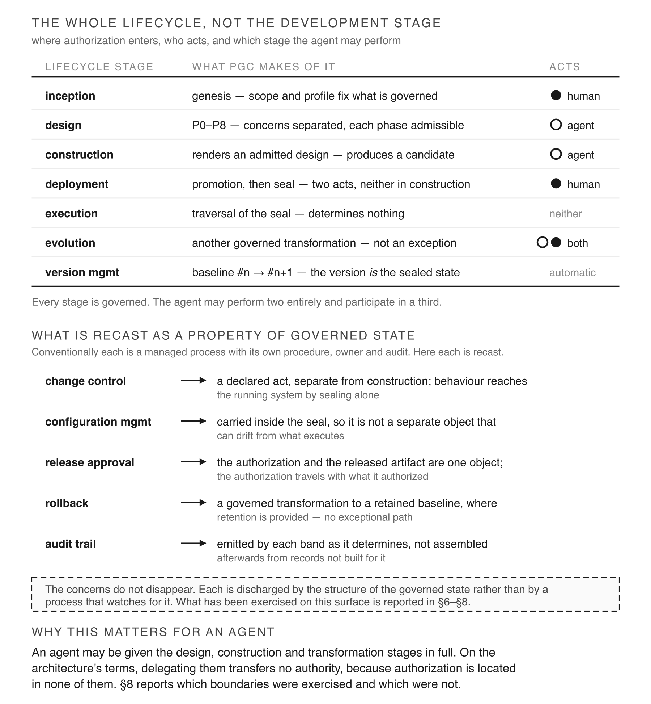{width=6in}

**Research question.** *Can an agent perform the analysis, design derivation, construction, and transformation work of a software lifecycle without becoming the authority over what the resulting software is permitted to do?*

This question separates two dimensions that are ordinarily bundled together:

- **Activity autonomy:** who may analyze, model, design, construct, test, and transform.
- **Authorization authority:** who may establish governing scope, admit a candidate, and promote it as the next executable baseline.

Modern software-engineering tools increasingly expand activity autonomy. Whether they also expand authorization authority is a separate architectural question. It can be answered by how the system is constructed, not by policy alone. Protocol-Governed Computing (Ganti 2026) addresses this by determining behavior during governed construction and sealing that determination into state that execution can realize but cannot change. When changing the worker does not change the authority over that state, the property is called *worker independence*.

This paper reports an empirical realization and evaluation of that architecture under agent-mediated engineering. It makes one primary and two supporting contributions:

| | Contribution | Where it is established |
| --- | --- | --- |
| Primary | An authority/activity collaboration model in which an agent performs open engineering work while authorization remains outside it | Sects. 4 and 8.2 |
| Supporting | An implemented governed lifecycle that makes the partition executable and inspectable rather than merely declarative | Sects. 5 and 7 |
| Supporting | Evidence of agent participation together with an analysis of where governance evidence is weak | Sects. 7 and 8.4 |

The final contribution is diagnostic: Section 8.4 distinguishes between guards that were present and required, and tests that showed the guard was actually necessary by removing it and observing failure.

The study evaluates the architecture's treatment of agency, not model capability, productivity, quality, security, cost, or general worker independence. Section 3 defines the research-question boundaries; Section 10 gives the complete limitations.

The architecture's requirements and lifecycle are established in a prior architecture specification (Ganti 2026), archived as a preprint at version v1 under DOI 10.5281/zenodo.21879948. That specification is a separate artifact by the same author — not an earlier version of this submission and not an extension of it. It states what the architecture requires; this paper reports one realization and evaluation of it. This paper investigates what it requires and can demonstrate when an autonomous producer performs the engineering work. The distinction is narrow but consequential: activity autonomy may increase without transferring authority over executable state.

**How the paper is organized.** Section 2 positions the work against adjacent mechanisms and states
the concepts inherited from the prior architecture specification. Sections 3 to 7 are the study's method: Section 3 gives the
research questions, the evidence grading scheme and the interpretation boundary; Sections 4 to 6
describe the subject under study — the authority model, the lifecycle that implements it, and the
realization in which both are exercised; and Section 7 reports the procedure, one worked
agent-mediated transformation. Section 8 gives the results question by question, each at the evidence
rung its record supports. Sections 9 to 11 discuss what follows, what threatens the interpretation,
and what the study concludes. Appendix A is a reproduction guide; Appendices B to D hold the phase
inventory, the run dossier and the mutation ledger.

## 2 Background and positioning

### 2.1 Agent participation as activity patterns

Work on LLMs in software engineering describes several arrangements. We distinguish them by agent activity and human involvement.

**Assistant.** The human specifies. The agent generates. The human accepts or rejects the output
(Vaithilingam et al. 2022).

**Collaborator.** Human and agent build an artifact together, in turns. Neither produces it alone
(Ross et al. 2023).

**Autonomous engineer.** The agent receives a goal — an issue, a defect report — and performs
several lifecycle activities with limited intervention (Jimenez et al. 2024).

**Agentic software engineering.** The agent plans, invokes tools, edits a repository, runs tests,
diagnoses failures and iterates (Yang et al. 2024). The loop can close without step-by-step human
intervention.

Each pattern is illustrated by one representative work. The cited work is an example of the pattern, not the source of its definition.

These patterns are analytical lenses, not a formal taxonomy. They are not mutually exclusive, and a single system may exhibit several patterns. We use them only to position the present study relative to prior work, not to classify existing systems.

What these patterns do not describe is authority. In the conventional arrangements considered here,
an agent's output becomes part of the running system after human acceptance or pipeline admission.
That decision is an event, and the executable state that follows need not record it. Recent
work on LLMs as reviewers finds that the judgement itself can be unreliable — LLMs systematically
misclassify conforming code as non-compliant, and elaborate prompting makes the problem worse
(Jin and Chen 2026). If an agent's judgement carries authority, its errors carry authority too.

### 2.2 What existing mechanisms establish

Several mechanism families govern parts of a software lifecycle. Each solves a real problem, but
their primary purposes differ from carrying authorization in executable state.

**Supply-chain provenance.** Supply-chain Levels for Software Artifacts (SLSA; OpenSSF 2026), in-toto
(Torres-Arias et al. 2019), Sigstore (Newman et al. 2022) and reproducible
builds (Reproducible Builds 2026) establish how an artifact was produced. They answer *where did this come from*
with precision. Provenance can accompany authorization, but alone does not answer whether the
artifact's behaviour is permitted. A fully attested build of unauthorized code remains unauthorized.

**Admission and policy.** Kubernetes admission controllers (Kubernetes 2026) and Open Policy Agent (OPA 2026) can
decide what enters an execution boundary, while the Secure Production Identity Framework for Everyone (SPIFFE; SPIFFE 2026) establishes workload
identity.
In usual deployments, these decisions are evaluated at a control or request boundary rather than
carried in the executable artifact. Admission therefore does not, by itself, show that subsequent
behaviour is authorized by the state the workload executes.

**Model-driven engineering.** Model Driven Architecture (MDA; OMG 2014) and Business Process Model and
Notation (BPMN; OMG 2011) support declarative descriptions of
behaviour at design time. Models may drive code generation or execution, but the relationship between
model, generated state and later transformations depends on the toolchain. Without a retained,
enforced link, generated code can diverge from its model.

**Test adequacy and mutation analysis.** The technique used here is established, and its lineage matters. Mutation analysis asks whether a test suite can actually detect a fault: a fault is introduced deliberately, and if the tests still pass, the suite has failed to demonstrate that it can detect that fault (DeMillo et al. 1978; Jia and Harman 2011).

This study adapts the method, not the underlying idea. Classical mutation analysis tests whether program tests can detect faults in code. Here, the same approach tests whether demonstrations can detect the removal of a governance guard. If a demonstration still passes after the guard is removed, the demonstration has not shown that the guard was necessary.

The `discriminating` rung in Section 3.2 defines this criterion. Section 8.4 therefore reports a mutation-adequacy result about governance evidence, rather than about the code itself.

**Change and release management.** Change boards, approval gates and configuration audits are
processes that watch for authorization. They work by convention and record-keeping. The record is
kept beside the system rather than inside it.

The comparison is not that these approaches fail. They answer adjacent questions: provenance
characterizes production; admission constrains entry; identity identifies a workload; models describe
intended behaviour; and approval records an event. In general, they do not make authorization a
property of the state the runtime executes. Table 1 sets them side by side on that axis.

**Table 1** Related work by locus of authority. Columns give, for each approach, who performs the engineering work, who authorizes the resulting executable state, and whether that authorization decision is carried in the artifact that executes.

The cut is *who performs* against *who authorizes*, not lifecycle stage. **Carried in the artifact**
has the sense given in §2.2: the authorization decision is represented in the executable state
itself, so a party absent when the decision was made can read it from what the system carries. A
"no" does not mean an approach lacks policy or provenance; it means the decision is not part of what
executes.

| Approach | Who performs the engineering | Who authorizes the resulting state | Carried in the artifact? |
|---|---|---|---|
| AI as assistant (Vaithilingam et al. 2022) | human specifies, agent generates | human, implicitly at acceptance | no |
| AI as collaborator (Ross et al. 2023) | human and agent iterate | human, implicitly and continuously | no |
| AI as autonomous engineer (Jimenez et al. 2024) | agent, from a goal | unstated — acceptance is the only gate | no |
| Agentic software engineering (Yang et al. 2024) | agent plans, invokes tools, edits, tests, iterates | unstated — repository write access *is* authority | no |
| Supply-chain provenance (OpenSSF 2026), (Torres-Arias et al. 2019), (Newman et al. 2022), (Reproducible Builds 2026) | either | not addressed — attests production, not permission | provenance only |
| Admission and policy (Kubernetes 2026), (OPA 2026), (SPIFFE 2026) | either | policy engine, at a boundary, per request | no — policy is external |
| Model-driven engineering (OMG 2014), (OMG 2011) | either | not addressed — models are generation inputs | no |
| Change and release management | either | an approval event, recorded beside the system | no |
| **PGC** (Ganti 2026) | agent may perform every open step | established at scope, authorized at promotion, declared | **yes — in the sealed snapshot** |

The first four rows are the analytical patterns of §2.1, each cited to one representative instance
rather than to a settled taxonomy. The remaining rows name mechanism families.

*Carried in the artifact* has one precise sense throughout: the executable state itself represents the
authorization decision, so a party absent when someone made that decision can still read it from what
the system carries. A "no" in that column does not mean an approach lacks
policy or provenance. It means the decision is not part of what executes.

### 2.3 Inherited concepts, and what is new here

This paper builds on an existing architecture. The following terms are defined in the prior architecture specification (Ganti 2026).

A **baseline** is a system's current sealed state. A **snapshot** is the artifact that carries it,
identified by its own content. **Sealing** makes that state immutable. A **transformation** takes one
baseline to the next; nothing is ever built greenfield. **Promotion** is the act by which a validated
candidate becomes the next baseline. **Worker independence**: the governing authority does not change when the authoring actor changes (Ganti 2026).

That specification establishes those requirements and states that the architecture does not depend on who
performs the work: a human, a model, or a hybrid can author. At all stages, the resulting state is
subject to the same governing authority.

That claim is the starting point of this paper, not its conclusion. The specification establishes the property from the architecture. It does not show what happens when an agent carries out a complete lifecycle under that architecture, what evidence the lifecycle produces, or where that evidence is insufficient.

Four additions to what the specification established carry the three contributions named in Section 1:

1. **An agent-participation reading of the architecture.** The activity/authority partition is presented as a collaboration model, not only as an architectural requirement.

2. **Implemented lifecycle evidence.** Declared phases, rule sets, priors, and refusals are examined in a working implementation rather than only in the specification.

3. **A worked agent-mediated transformation.** An agent performs one complete governed change, with its refusals and successor identity recorded.

4. **An evidence-adequacy analysis.** The study tests whether demonstrations supporting governance claims fail when the guard they test is removed.

The prior architecture specification (Ganti 2026) addresses where authorization should reside in the architecture. This paper does not repeat that argument; it asks what the architecture requires and demonstrates when the producer is autonomous.

## 3 Research questions and study design

This section defines the questions investigated, the unit of analysis for each, and the limits of the
evidence. The study is a bounded evaluation of one implementation, one agent-mediated transformation,
and a targeted mutation set. It is a bounded architectural case study, not a capability benchmark, and not a test of whether autonomous
agents in general can perform software engineering.

### 3.1 Research questions

**RQ1 — Activity autonomy.** *Under the declared governance conditions, can the studied worker
execute the analysis, design derivation, construction, testing and transformation activities
required for one governed change, under the supplied realization and harness?*

The unit of analysis is one complete governed transformation. Its input is a business need in natural
language; its output is a sealed successor baseline. Evidence consists of the retained phase
artifacts, their identities, the transformation record, and the resulting sealed state.

A positive result shows that this worker executed the exercised activities under these conditions.
It does not show that an arbitrary agent can do so, that this worker would succeed on a different
change, or that the resulting software is correct, secure, useful or efficient. The wording is
narrower than *can an agent perform software engineering* by design. One case demonstrates
performability for the exercised path. It cannot support a population claim without more tasks,
workers or replications.

**RQ2 — Authority separation.** *For the authority boundaries the transformation exercises, does the
governing mechanism prevent
the worker from changing scope, mutating the sealed baseline, promoting its own candidate, or causing
executable behaviour not determined by the retained sealed inputs, declarations and runtime rules?*

The unit of analysis is a boundary, not a run. Four are examined separately: scope, baseline
integrity, promotion, and behavioural determination. For each, we report the mechanism, whether the
boundary was reachable, the attempted or observed violation, and the resulting refusal, identity
comparison or runtime outcome. A claim that the architecture prohibits an action is not an
observation. Where a boundary was not directly exercised, the result is reported at the rung it
reached rather than as observed.

The question applies only to the exercised scaffold, and *outside the worker* is not equivalent to
*authenticated human authority*. Section 8.2 reports each boundary at the rung its evidence supports.

Scope was not attempted, and the implementation offers no promotion operation at which an attempt
could be refused. These remain non-observations, and Section 8.2 gives the boundary-level results.

**RQ3 — Independent inspectability.** *Can a reviewer who did not participate in the run reconstruct
the authority relation, artifact contents and predecessor-to-successor relation from the retained
records alone?*

The unit of analysis is the retained artifact set. The procedure is reconstruction from sealed
identities, declarations, phase records, evidence records and carried artifacts, without relying on
undocumented statements by the operator or worker.

RQ3 is evaluated by artifact sufficiency, not by an executed reconstruction. No evaluator worked from the retained artifacts alone against
questions fixed in advance. The study establishes that the retained set supports the reconstruction,
not that an uninvolved party performed one. Section 8.3 reports it at the *reachable* rung for that reason, and Section 10.2 records
the omission as a limitation.

This is a claim about reconstructability, not authenticity. Local sealing identifies retained content
within the realization. It does not establish who authored a record, prevent an operator from
altering a record before sealing, or provide non-repudiation. The reconstruction therefore
distinguishes *the record states that X occurred* from *an authenticated actor performed X*.

**RQ4 — Evidence discrimination.** *Do the demonstrations used to support governance claims
distinguish the conforming implementation from one in which the claimed guard is removed or altered?*

The unit of analysis is a demonstration–guard pair. Six mutation instances span five guard families. The
refusal family contributes two, counted separately wherever a total appears, and every total in this
paper follows that convention. The procedure applies a declared
mutation to
a property the profile requires, then re-runs the demonstration offered as evidence for it. A
demonstration is discriminating only when the mutation changes the recorded result in the direction
the guard predicts. If it still passes, it establishes neither that the guard was exercised nor that
the original result discriminated against the violation.

RQ4 is an adequacy check on evidence, not a second benchmark. Six mutation instances give diagnostic examples
of evidence strength. They do not estimate coverage, failure probability, or the prevalence of
inadequate tests, and they test selected guards rather than the whole governance surface. Because the
a different worker devised the mutations from the one that produced the realization, one source
of self-confirmation is reduced — not removed.

### 3.2 Evidence grading and refusal classification

A governance property may be specified and implemented without ever being exercised. Every claim
therefore receives the highest rung its evidence supports.

| Rung | Meaning |
| --- | --- |
| **declared** | the specification states that the property exists |
| **resolved** | a mechanism implementing it exists in the realization |
| **reachable** | the mechanism can be invoked on the relevant subject or transition |
| **discriminating** | a targeted violation changes the result as predicted — the mutation-adequacy criterion (DeMillo et al. 1978), applied to evidence rather than to test data |
| **observed** | the reported run exercised the property or transition |

The rungs are related but not interchangeable. A mechanism can be resolved without being reachable.
A reachable refusal path can be exercised without a mutation showing that its guard discriminates.
An observed successful transformation does not establish every boundary in the architecture.
Sections 7 and 8 report a rung for each claim rather than using *demonstrated* as an undifferentiated
label.

Refusals are classified by the transition they block. A **phase refusal** prevents entry into a required lifecycle phase. A **construction refusal** prevents formation of a candidate after that phase has been entered. An **admission refusal** rejects a formed candidate before promotion. The error text is supporting detail, not the classification criterion. Each refusal reported below identifies the blocked transition and its rung.

RQ4 follows from a result of this study. Six demonstrations tested required guards: four detected the removal of the guard, but two still passed after the guard was removed. The implementation may still contain those guards, and the profile still requires them. The result shows only that the two demonstrations were insufficient to establish that the guards were actually enforced.

### 3.3 Study objects, provenance and roles

**Reference realization.** Seven governed domains and 410 protocol artifacts at composition ordinal
15 under one governance surface, sealed as `3e81773b…`. Every domain graph address matches the
preceding composition byte for byte; the two snapshots differ only in the embedded ordinal, which is
carried in a constituent and therefore enters the identity. This is a provenance and comparison
object, not an independent performance sample.

**Separately built realization and transformation.** The worker authored a profile from the frozen specification
alone, and a separate build produced a realization claiming it. The transformation studied as `G4`
takes the frozen baseline `70dd9dea…` to the sealed successor `48fd5a4d…` under profile `NPP-E`, at
family revision `f476ea5c…`.

**Mutation set.** Six mutation instances across five guard families, all of properties the profile requires, applied to the realization's own
demonstrations. For each case the ledger retains the mutation identity, target guard, predicted
effect, observed effect and resulting classification.

**Roles.** The worker and the commissioning side were separate models, recorded in the run
conditions before this study drew on them:

| Role | Model | Harness |
| --- | --- | --- |
| Worker — authored profiles, built the realization, performed G4 | Claude Haiku 4.5 | GitHub Copilot |
| Commissioning and evaluation — wrote instruments, classified findings, devised and ran mutations | Claude Opus 5 | agentic coding harness |

No sampling parameters were set in either harness. The separation is relevant to RQ4, because the
mutation designer was not the worker whose demonstrations were tested. It does not constitute
independent replication. The operator recorded model attribution after the runs; the harness did not
capture it. That makes it provenance reported with a caveat rather than a property the execution
established.

**The author's use of AI tools, distinct from the models studied above.** Models of the Claude Opus
family — most recently Opus 5, released partway through the development period this paper draws on —
were used by the author as a coding assistant during development of the reference implementation, to
extract and tabulate evidentiary material from it (counts, identities, revisions and mutation re-run
results) for presentation here, and for drafting assistance on the manuscript under the author's
direction. No model is an author. The author is accountable for the final text and for every claim,
interpretation and conclusion in it.

### 3.4 Non-benchmarks and interpretation boundary

This study evaluates how the exercised architecture treats agent participation. It does not measure
model capability, productivity, output quality, cost, security or software quality. Naming the worker
model supports reproducibility; it is not a comparison. One worker completing one transformation is
evidence for the bounded RQ1 case — not a baseline, and not evidence that model choice is immaterial
in general.

Nor does the study establish worker independence beyond the exercised scaffold. It does not evaluate
distributed trust, signatures, multi-party approval, external effects, malicious operators or
deployment-scale behaviour. The conclusion the design supports is narrow: for the tested realization
and transformation, the retained evidence supports activity autonomy by the worker and separation of
the tested authority boundaries at the reported rungs. Unexercised boundaries remain declared,
resolved or reachable according to their records. They are not promoted to observed because the
architecture requires them.

Table 2 maps each research question to its unit of analysis, procedure, claimed boundary, evidence
artifact, achieved rung and non-claim. It is part of the study design, not a results summary: it
states in advance what would count as support and what the experiment cannot establish. Section 8.2
resolves RQ2 boundary by boundary once the results are in.

**Table 2** Research questions. For each question: the unit of analysis, the procedure applied, the boundary claimed, the evidence artifact, the rung reached on the evidence ladder of Sect. 3.2, and what the question does not establish.

| RQ | Unit of analysis | Procedure | Claimed boundary | Evidence artifact | Achieved rung | Non-claim |
|---|---|---|---|---|---|---|
| RQ1 | one governed change | worker performs P0–P8 and construction; candidate compiled and sealed | the worker-performable path ends at candidate production | the G4 run dossier; successor `48fd5a4d…` | **observed** | that a different author obtains the same result |
| RQ2 | four authority boundaries | see 5b | authority does not move with the authoring actor | carried artifact identities; refusal records | **observed** ×2, **declared** ×2 | external effects; the profile selects no interaction boundary |
| RQ3 | the retained record set | enumerate what a holder of the artifacts alone can establish | the successor and authority relation is reconstructable | snapshot identity, evidence records, inspection surface | **reachable** | that a third party performed the reconstruction; sealing is integrity, not signature |
| RQ4 | demonstration–guard pair | disable the guard, re-run its demonstrations | the evidence discriminates against the guard's absence | the mutation ledger, Table 6 | **discriminating** ×4, **reachable** ×2 | a mutation score; selection was risk-directed and not preregistered |

## 4 Authority-partitioning collaboration architecture

The architecture separates two things that conventional lifecycles bundle together. This section
states the separation, the boundaries that enforce it, and the observations that would falsify it.

### 4.1 Two dimensions

**Activity autonomy** is the question of who may analyze, model, design, construct, test and
transform. **Authorization authority** is the question of who may establish governing scope, admit a
candidate, and promote it as the next executable baseline.

Conventional practice treats these as one: a developer who writes a change and merges it has
exercised both, and an agent with repository write access inherits both together. The architecture
examined here separates them structurally rather than procedurally — the agent has a broad
engineering surface and no path to the withheld decisions.

Fig. 3 shows the arrangement. Human acts establish scope and problem before the work and authorize
promotion after it; agent activity occupies the span between, and the runtime sits below the seal with
neither role. The activity row is a summary of what an agent may do, not a dependency graph; Section 5
gives the ordering.

{width=6in}

### 4.2 Two boundaries

Two boundaries carry the separation, and they do different work.

**The governed transformation boundary** sits between the human acts and the agent's work. It fixes
what may be done before anything is derived. Scope, the normative profile and the baseline are
established on one side; analysis, design and construction happen on the other. We use *governed
transformation boundary* rather than *protocol* throughout, because *protocol artifact* names
something else in this architecture: a declaration the runtime executes.

**The seal** sits between determination and execution. Above it, behaviour is determined. Below it,
behaviour is realized. The runtime reads the sealed baseline and traverses what it finds; it does not
add to it.

The two boundaries are asymmetric in an important way. The first constrains which agent-produced
decisions can become governed state — not whether the agent decides. Inside the surface the agent
exercises ordinary engineering discretion, and much of what it decides is consequential. The second
constrains what execution may *become*. An agent that never crosses the first cannot enlarge the
second, because everything below the seal was determined above it.

The architecture presents two principal authority boundaries. Several distinct authority properties
are enforced or exposed across them, and those properties — not the boundaries — are what 4.3 and 4.4
enumerate. The two are architectural abstractions. The six are operational, and the implementation
distributes them rather than mapping them one-to-one onto the boundaries: scope and profile authority are established before the first boundary, baseline integrity
and promotion are decided at it, and behavioural determination is a property of the second.

### 4.3 The collaboration contract

Fig. 4 states the contract as containment. Inside the governed surface, the agent's reach is
deliberately wide: derive, analyze, query the baseline, model the domain, design, construct, render
artifacts, transform, revise and resubmit. No step in that set is reserved to a human, and performing
any of them confers no authority.

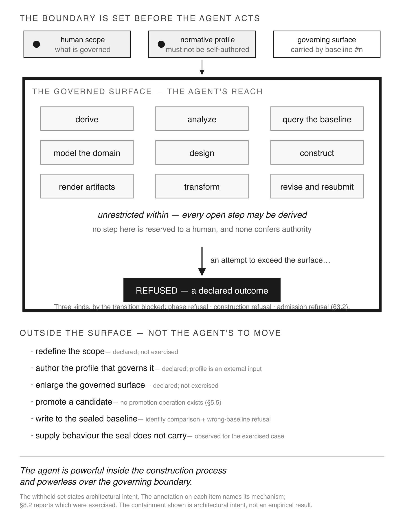{width=6in}

That list states the reach the architecture intends. Section 7 reports which of those operations
this study exercised; the remainder are available by design rather than by demonstration.

Outside the surface sit six decisions the agent cannot make: redefine the scope, author the profile
that governs it, enlarge the governed surface, promote a candidate, write to the sealed baseline, or
supply behaviour the seal does not carry.

The asymmetry is the point. The withheld set is small. It is also decisive. An architecture that
withheld more would constrain the agent's usefulness; one that withheld less would not separate
authority at all.

Table 3 maps the contract across the lifecycle by activity, distinguishing three things a single
column would conflate: who holds authority, who performs the work, and what the machine enforces.
Two cells deserve care in reading. The human *authorizes promotion of the result*, not the agent's
construction act — construction requires no authorization because it produces nothing authoritative.
And where the table says the human *may inspect or evaluate*, that is an available action, not a
required one; the architecture does not depend on a human reading agent output.

**Table 3** The collaboration model by lifecycle activity. Three columns are kept apart: who holds authority, who performs the work, and what the machine determines or enforces.

Three questions are kept apart in every row: who holds authority, who performs the work, and what
the machine determines or enforces.

| Activity | Human authority | Agent activity | Machine determination |
|---|---|---|---|
| Scope | authoritative | cannot establish | recorded in the profile |
| Business problem | authoritative | may elaborate, may not decide | constrained by the P0 rule set |
| Analysis | may inspect | performs | checked — P2–P4 rule sets, grounding at P2 |
| Design derivation | may inspect | performs | checked — P5–P7, 93 rules |
| Construction | none required — the act confers nothing | performs | checked — material is refused, not repaired |
| Admission | none required | produces the candidate that is judged, but does not decide | **enforced** — compilation admits or refuses |
| Promotion | authoritative — an operator act | cannot perform; no promotion operation exists | **not enforced at a promotion call** — the separation is structural, §5.5 |
| Sealing | none required | cannot perform | **enforced against admission** — only compiled, attested projections are sealed |
| Execution | no intervention required | absent | enforced — traversal only, no new determination |
| Evolution | authorizes the successor | performs the transformation | checked — identity derived from content, carried artifacts comparable |

Two cells are read wrongly if taken alone. The human authorizes *promotion of the result*, never the
construction act — construction requires no authorization because it produces nothing authoritative.
And *may inspect* is an available action, not a required one: the architecture does not depend on a
human reading agent output.

### 4.4 What would falsify the model

An architecture that cannot be contradicted by observation is not an empirical claim. Five
observations would falsify the partition as stated:

1. **Scope mutation.** The agent alters what is governed, rather than working within it.
2. **Self-authored profile.** The agent authors the profile that governs the system it is building.
3. **Baseline write.** The agent modifies a sealed baseline rather than producing a successor.
4. **Self-promotion.** The agent promotes its own candidate to the next baseline.
5. **Undetermined behaviour.** The exercised runtime produces an outcome not determined by the
   retained sealed inputs, declarations and runtime rules for the tested case.

A sixth is weaker but worth stating, because it is the one most easily missed: a **carried artifact
identity changing** across a transformation would show that a transformation had rewritten rather
than extended a baseline.

Each of these is an observation, not an architectural statement. Section 8 reports which were
exercised, which were refused, and which remain declared. That distinction is the difference between
an architecture that forbids something and an architecture observed to prevent it.

Interpretation follows the evidence rungs of Section 3.2: an absent attempt is not a refused attempt,
and a design claim is not an observation. Section 8 reports the rung each indicator reached.

Sealing is local and unsigned, with the consequence stated in 3.1: these observations separate the
agent from other actors in the realization, not one authenticated actor from another. The fifth holds
only for the tested case. Section 10 records both limits, and states the threat model in full.

## 5 The implemented governed lifecycle

This section describes the lifecycle as implemented. It is not an independent methodology
contribution. It is the mechanism that makes the partition of Section 4 executable and inspectable
rather than declarative, described here in the detail a reader needs to check that claim.

### 5.1 What the human establishes

Four things are fixed before the agent acts, and Fig. 5 separates them by origin.

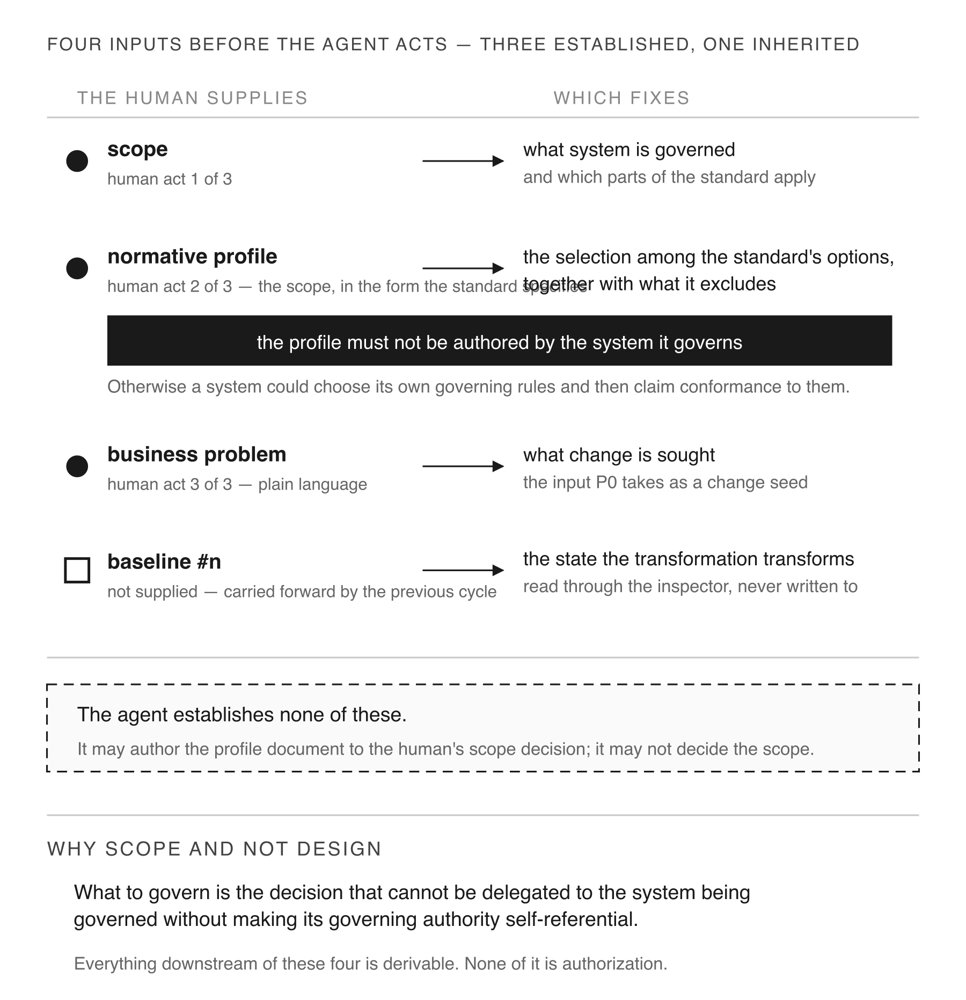{width=6in}

Three are established by a human. **Scope** names what system is governed and which parts of the
standard apply to it. The **normative profile** records that decision in the form the standard
specifies: an explicit selection among the options the standard permits, together with the options it
excludes. The **business problem** states, in plain language, what change is sought.

The fourth is not supplied by anyone. **Baseline #n** is carried forward by the previous cycle. It is
inherited state, not an input, and the figure marks it differently for that reason.

One rule governs the profile: it must not be authored by the system it governs. Otherwise a system
could select its own governing rules and then claim conformance to them. An agent may author the
profile *document* to the human's scope decision; it may not decide the scope. Authoring and deciding
are different acts, and the distinction recurs throughout the lifecycle.

### 5.2 The concern graph

The lifecycle comprises nine phases carrying eight concerns. Its structure is not a chain. Each
phase declares the priors it consumes, and those declarations, read from the implementation, describe
two branches from one root.

**The modelling branch.** P1 Change Request consumes P0. P2 Domain Model Verification consumes P1.
P3 Analysis Loop consumes P2. P4 Business Model consumes P3. The branch establishes what exists and
what the analysis finds.

**The intent branch.** P5 Business Intent consumes **P0**, not P4. P6 Governance Intent consumes P5
and P0. P7 Design Intent consumes P5, P6 and P0. P8 Authoring Mandate consumes P7.

Two properties of that structure follow. **No intent phase declares an analysis phase as a prior.**
And **nothing declares P4 a prior at all**: the modelling branch terminates. It verifies the problem
against the baseline; it does not hand a design forward.

What this supports is a declared dependency property, and it should not be read as more. The phase
relation does not list analysis as an input to intent, so an analysis result that redefined the
request would have to enter through a channel the graph does not record. That is not an
information-flow guarantee. The implementation does not close a phase's input surface, and an agent
authoring P5 has read whatever it read while authoring P3. The test that would raise this to the
observed rung — perturb a P3 or P4 artifact, hold P0 and the intent inputs constant, and check whether
the intent output changes — was not run.

The seed is cited rather than carried. P5, P6 and P7 each declare P0 directly. The implementation
states the reason: carrying it forward would mean a register and a carry rule in each intermediate
phase, restating what the seed already says and free to drift from it. Anti-drift is achieved by not
restating. The property holds while a phase cites the seed rather than copying it. The rule sets do not
check whether an author also transcribed seed content into a derived register.

**P2 is the grounding boundary.** P0 and P1 record `system_beliefs` and `assumptions`. P2 carries
`belief_verification` and `pps_baseline_fqdns`, and is the only phase declaring `GROUNDING_RULES`. An
agent's stated beliefs are confronted with baseline artifact identities rather than carried forward;
a cited artifact that does not resolve raises `BASELINE_IDENTITY_UNRESOLVED`. For AI-assisted
development this is the phase at which an unsupported citation is refused rather than carried, and it
does not depend on prompt discipline. It decides resolution, not truth: an assertion that cites a
resolving artifact is admitted whether or not the artifact supports it.

**P6 discharges into P7.** Design Intent carries `refusal_discharge`, `refusal_deferrals` and
`refusal_governance_discharge`. Governance intent is therefore not merely consulted by design; it
leaves an inspectable structural consequence in it. This is why P7 cannot precede P6, stated from the
artifact rather than by argument. What is shown is the structural record; that a change in governance
intent alters a design outcome is not tested here.

**P7 inverts one rule.** Every earlier phase cites artifacts that exist and is wrong when a citation
fails to resolve. P7 assigns identities that will exist, and is wrong when one already does: a code
colliding with something in the composition is not a new artifact but a silent redefinition of an old
one. `CITED_ARTIFACTS_ABSENT` is the only rule in the lifecycle that reads a successful resolution as
the defect.

Table 4 gives the per-phase reference: registers, rules, declared priors and inspection operations,
read from the implementation at one pinned revision of each repository. Three readings of that table should be resisted.
Declared priors are a dependency relation, not proof of semantic influence. Rule counts measure
implementation weight, not architectural importance — P7's seventy rules against three to twelve
elsewhere show a heavily constrained concern, not a more important one. And counts of either kind
describe representation size, not separation of concerns: what shows that one phase does not restate
another is which registers each owns, not how many each carries.

**Table 4** The P0-P8 rule sets. For each phase: the number of numbered template registers, the number of distinct rule identifiers, the priors the phase declares, and the inspection operations its rule set names.

Every column is read from `transformation/transformation/design/p*/rules.py` and the phase templates
at one pinned revision of each repository. Registers are the numbered template sections only; rules
are counted by distinct identifier.

| Phase | Registers | Rules | Priors consumed | Inspector operations |
|---|---:|---:|---|---|
| P0 Change Seed | 20 | 3 | — | — |
| P1 Change Request | 19 | 3 | P0 | — |
| P2 Domain Model Verification | 8 | 5 | P1 | `si.artifact.list` |
| P3 Analysis Loop | 7 | 10 | P2 | `si.artifact.list`, `si.snapshot.summary` |
| P4 Business Model | 7 | 8 | P3 | `si.artifact.list` |
| P5 Business Intent | 8 | 12 | **P0** | `si.artifact.list` |
| P6 Governance Intent | 6 | 11 | P5, **P0** | `si.artifact.list` |
| P7 Design Intent | 20 | **70** | P5, P6, **P0** | `si.artifact.list`, `si.capability.surface`, `si.rule_set.list`, `si.store.list` |
| P8 Authoring Mandate | 7 | 12 | P7 | `si.artifact.list` |

Three readings the table supports, and one it does not.

- **P7 carries seventy rules** against three to twelve everywhere else. That locates the
  implementation's weight in the design concern; it does not make that concern more important.
- **Only P2 declares `GROUNDING_RULES`.** The grounding boundary is a specific phase, not a posture.
  `BASELINE_IDENTITY_UNRESOLVED` fires when a cited artifact does not resolve against the baseline.
- **The priors are not a chain.** P5 consumes **P0**, not P4; P6 consumes P5 and P0; P7 consumes P5,
  P6 and P0. The intent phases ground in the stated problem rather than in the analysis of it.
- **What it does not support:** that a phase reads only its declared priors. The relation is
  declared, not enforced as a closed input surface — §5.2.

Fig. 6 draws the graph. Solid edges are declared priors between adjacent phases; dashed edges are
direct citations of P0.

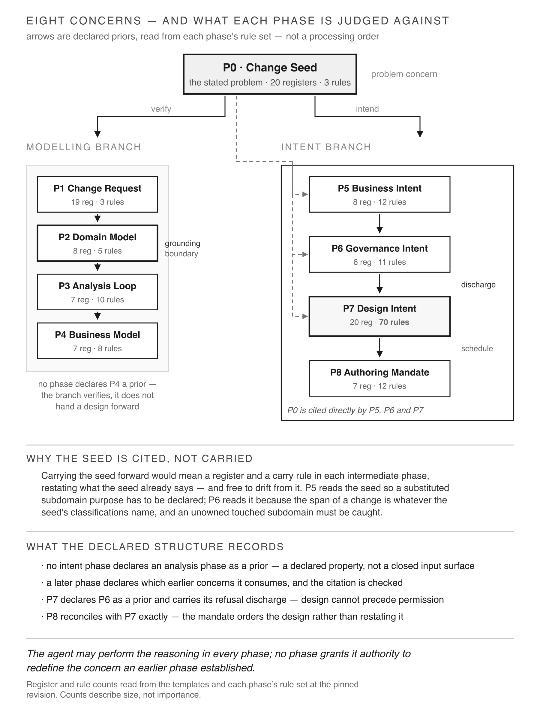{width=6in}

### 5.3 The intent partition

Four concerns separate across P5 to P8, and they are not four names for one specification.

**P5 Business Intent** asks what the business seeks. It admits provisional artifact codes, because
naming what you intend to build is how intent becomes specific. It may not admit a binding: a
domain-qualified name, a path, a module. Those belong to P7, and a phase reaching for them would be
deciding placement before governance intent had been established.

**P6 Governance Intent** asks what is permitted. Ownership, boundary rules, storage governance.

**P7 Design Intent** asks how permitted behaviour must be structured. It is where the separated
concerns become a design: resolution, execution topology, composition, step bindings, implementation
bindings, runtime policies, stores, transport bindings. It is also where provisional codes become
binding names used verbatim by later phases, the compiler and the runtime.

**P8 Authoring Mandate** asks what may be constructed, and in what order.

The asymmetry between the last two is visible in which registers each phase owns. P8's distinctive
registers — `build_order`, `critical_path` — introduce scheduling concerns absent from P7 entirely,
and no P8 register reproduces a P7 design register under another name. P8 does not restate the design.
It orders what the design determined. The counts, twenty against seven, describe size; the ownership
is what shows the separation.

Fig. 7 shows the chain. The claim it supports is narrow and load-bearing: natural-language reasoning
may traverse all four concerns without acquiring authority over any of them.

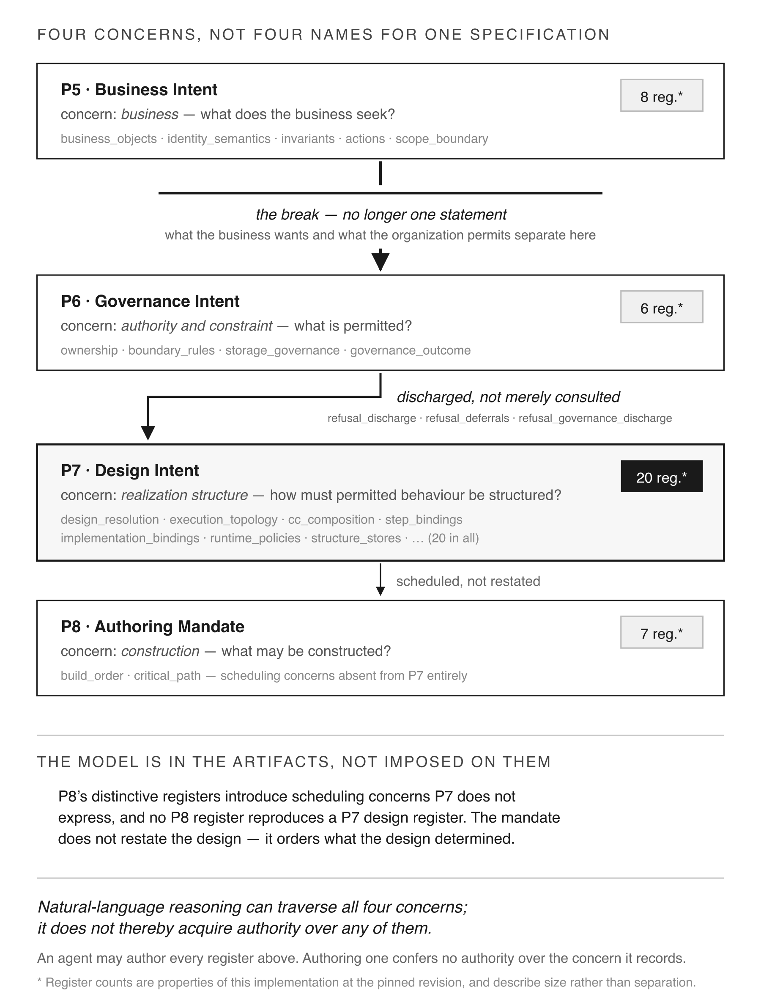{width=6in}

### 5.4 Construction

Construction renders an admitted design into executable artifacts. What it produces is a candidate,
and no act of construction makes a candidate the next baseline.

Three claims should stay apart, because a single sentence has collapsed them elsewhere. That
construction does not *authorize* a candidate follows from the candidate/admission/promotion
separation described in 5.5. That construction does not alter the governing scope or the sealed
baseline is a property of the write path, evidenced here only by comparison of carried baseline
identities. That construction adds no semantic behaviour absent from the design is stronger still: it
would require a trace from design registers to rendered artifacts together with negative tests for
unsupported rendering, and this study does not establish it.

The pipeline separates two compilation problems, and they differ in how they fail. A **design
failure** is an incomplete or contradictory mandate, caught by a phase's rule set. A **construction
failure** is a valid mandate that does not provide sufficient information to determine the required
artifact. Only rendering exposes the second, and the repair amends the design language rather than
any single register.

Rendered artifacts then pass through protocol compilation, where material violating the governing
surface is refused rather than silently repaired.

What construction produces is a **candidate**: a proposal to the authorization boundary, not an
extension of it, as Fig. 8 marks. Section 5.5 defines the admission, promotion and sealing
transitions.

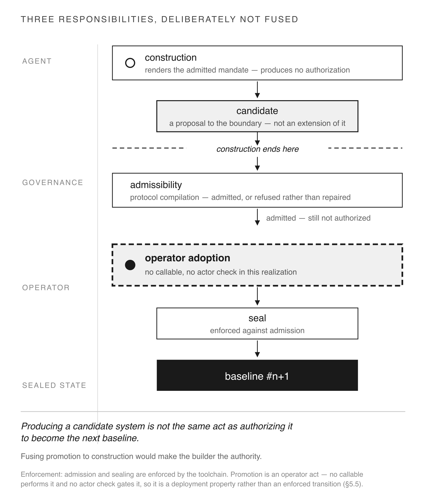{width=6in}

### 5.5 Promotion and sealing

Promotion and sealing follow as separate acts, deliberately not fused to construction. Producing a
candidate system is not the same act as authorizing it to become the next baseline.

The modelled order is `candidate → admitted → promoted → sealed successor`. The implementation
enforces two of its three transitions, and the paper does not claim the third.

A compact notation makes which is which impossible to miss. Writing `S` for the governing scope, `P`
for the normative profile and `B_n` for the current sealed baseline:

> `B_{n+1} = Adopt( Seal( Admit( Construct( Transform(B_n, S, P) ) ) ) )`

`Transform` and `Construct` are the agent's surface: unconstrained in their internal decisions, and
constrained only in what they may take as input and emit as output. `Admit` and `Seal` are **enforced
by the toolchain** — protocol compilation refuses inadmissible material, and the assembler consumes
only compiled projections. `Adopt` is **not implemented as a function**: no callable promotes a
candidate and no actor check gates one, so in this realization it is an operator act performed outside
the composition, and `B_{n+1}` becomes the baseline because an operator treats it as one. `S` and `P`
are fixed before the expression is evaluated and are not outputs of any term in it.

**Admission is enforced.** Protocol compilation admits a candidate or refuses it, and it emits the
projection metadata and structure attestation that record the determination.

**Sealing is enforced against admission.** The assembler reads only compiled projections. It fails
hard when a projection or attestation hash is missing or empty, and when the compiler's own hash
statements disagree with one another. Unadmitted material has no path to a sealed snapshot, because
sealing consumes the compiler's output rather than the candidate.

**Promotion is not a distinct operation in the implementation.** No callable promotes a candidate and
no actor check gates one. Promotion in the exercised realization is the operator's act of running
assembly against a chosen admitted candidate and adopting the result as the next baseline. That the
act lies outside the agent's reach is a fact about the deployment, not an enforced transition, and
Section 8.2 reports it on those terms.

A candidate can therefore be admissible and still not be the next baseline — admitted is not
authorized, which is what Fig. 8 makes its most visible transition. But the evidence for that
separation is the absence of a promotion path in the agent's surface, not a refusal observed at one.

### 5.6 Execution

Execution reads the sealed baseline, admits at the boundary only what the baseline permits, follows
the behaviour determined there, and emits only declared outcomes. It does not modify the baseline or
make new governance decisions.

**Traversal-only, defined operationally.** *The runtime selects and executes only declared nodes,
bindings, routes and outcomes; it does not add nodes, routes, declarations or governance rules.* Three
things a reader may expect to fall outside that definition do not. Recording state is traversal: the
runtime writes what a declared effect declares it writes, and the write introduces no node or route.
Dispatching an effect is traversal: the effect is named by the capability contract in the sealed
state. Refusing is traversal: a refusal is a declared outcome of a declared node, not a new
determination. What the definition excludes is *introduction* — a route the snapshot does not carry,
a default the declarations do not supply, a governance rule decided at execution time.

The definition is used consistently below and is not a proof of general runtime safety. It bounds
what execution may introduce, not whether what was declared is correct, and it says nothing about what
a declared effect does outside the system.

Fig. 9 states the five things it cannot do: infer behaviour the baseline does not carry, create a
route, supply a default, change governance, or modify the baseline. On the model's terms, a behaviour
absent from the baseline is not merely unimplemented — there is no path by which execution could
introduce it. Those five are declared prohibitions of the execution model, and they are separate
properties requiring separate stimuli. Section 8.2 reports which the exercised case bears on; one
successful traversal is not evidence for all five.

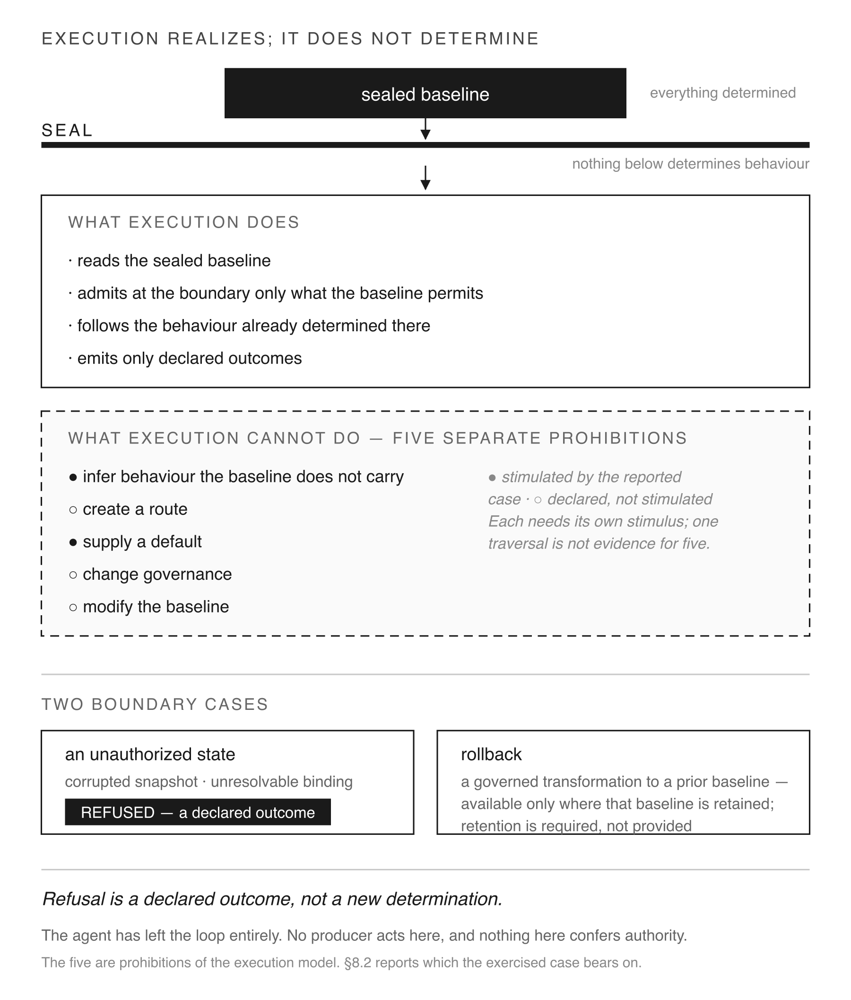{width=6in}

Two boundary cases matter. Encountering a state the baseline does not authorize, execution refuses,
and the refusal is a declared outcome rather than a new determination. Rollback is a governed
transformation to a previously sealed baseline, and it works only where an operator retains that
baseline. The architecture requires retention; it does not provide it.

### 5.7 Agent-mediated evolution

The conventional agentic pattern is short: the agent edits the repository, and the edit is the new
behaviour. There is no authorizing act, because the write *is* the authorization.

The governed pattern inserts one. The agent transforms baseline #n into a governed candidate,
compilation admits it, an operator promotes it, and sealing makes it baseline #n+1 — which becomes #n
for the next cycle. Fig. 10 places the two loops side by side.

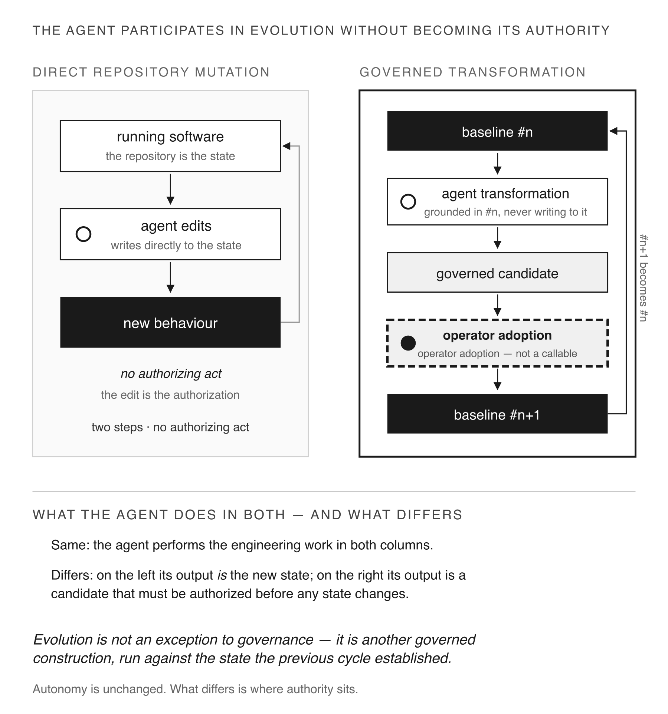{width=6in}

The agent performs the engineering work in both. The output differs: on the left it becomes the new
state directly, on the right it becomes a candidate that someone must authorize before any state
changes. Evolution follows the same discipline as any other governed construction, run
against the state the previous cycle established.

## 6 Reference realization

The preceding sections introduced the authority partition and the lifecycle in the abstract. This
section introduces the system in which they are realized.

**Protocol-Governed Computing (PGC) makes software machine-performable across the whole lifecycle
while separating authorized behaviour from its implementation.** Rather than governing implementation
after it has been constructed, PGC determines admissible behaviour *during* governed construction and
makes implementation a realization of that determination. This inverts the usual governance problem:
authority is established before executable state exists, rather than inferred from or imposed upon
the code that produces it. The resulting state is sealed with content-derived identities and retained
artifacts; execution traverses it and is not the point at which permitted behaviour is decided, and
evolution applies the same discipline by transforming sealed state into a governed successor.

The span is what makes this consequential here. It runs from a stated problem through analysis,
domain modelling, intent, design, an authoring mandate, construction, admission and sealing, to
execution and then evolution. PGC is therefore neither a design notation that stops at the diagram
nor a deployment-time policy layer that starts at the boundary: the engineering lifecycle itself is
machine-performable. An agent can perform substantial engineering activity across that span without
thereby becoming the authority that determines the executable result — which is the property this
paper examines, and Section 8 reports how much of it the study observed.

The reference realization comprises nine repositories, eight published as `pgc-*` distributions. The
remainder of this section identifies the realized components and the inspectable artifacts; Section 7
examines their use in an agent-performed governed transformation.

### 6.1 Components and artifact flow

Fig. 11 maps components to responsibilities along the artifact flow.

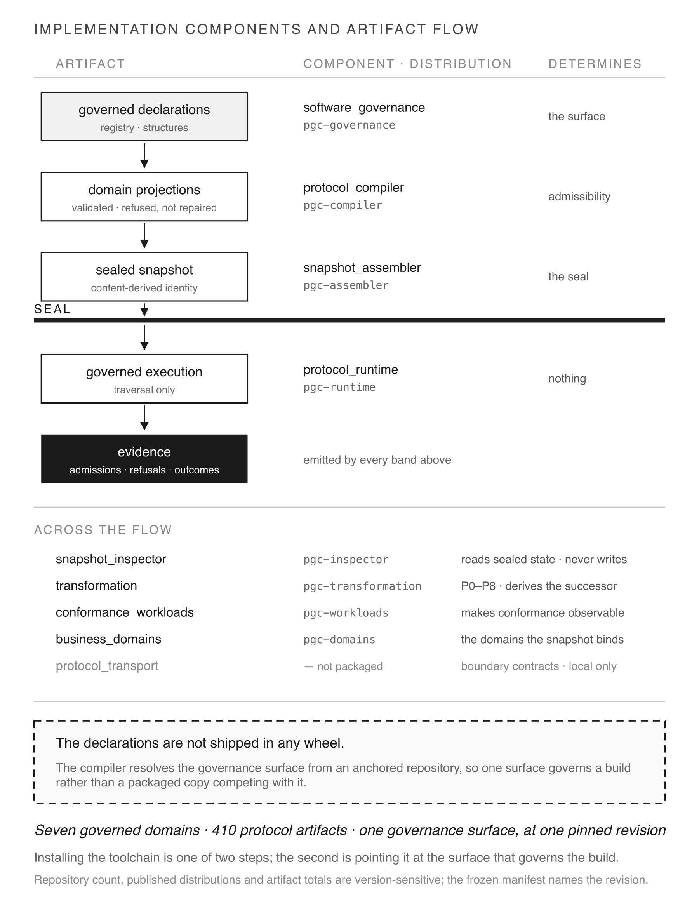{width=6in}

Governed declarations are authored in the governance surface (`software_governance`). The compiler
(`protocol_compiler`) resolves and validates them into domain projections, refusing rather than
repairing material that violates the surface. The assembler (`snapshot_assembler`) composes validated
projections into a sealed snapshot carrying a content-derived identity. The runtime
(`protocol_runtime`) reads that snapshot and traverses it. Evidence is emitted by every band above.

Four components sit across the flow rather than on it. The inspector (`snapshot_inspector`) provides
the read surface, with declared operation identities; it never writes. The transformation compiler
(`transformation`) implements P0–P8 and the construction stage. Conformance workloads
(`conformance_workloads`) make conformance observable. Business domains (`business_domains`) supply
the domain implementations the snapshot binds. A ninth repository, `protocol_transport`, holds the
boundary contracts and is not packaged; the profile exercised here selects no interaction boundary.

One property of that arrangement is worth stating because it is easily assumed away. **The
declarations are not shipped in any package.** The compiler resolves the governance surface from an
anchored repository, fail-hard and independent of working directory. A registry inside a distribution
would create a second governance surface competing with the repository's, and a stale copy could then
govern a build.

### 6.2 What is inspectable

Four things can be read from a sealed composition without access to the people or models that
produced it.

**Identity.** The snapshot carries an identity derived from its own contents, as does each domain
graph and each artifact.

**Declarations.** The compiled projections state what was admitted and against which rule.

**Evidence.** Admissions, refusals with their causes, execution outcomes and the routes that carried
them.

**The inspection surface.** Read operations with declared identities — `si.artifact.list`,
`si.snapshot.summary`, `si.capability.surface`, `si.store.list` — are the same operations the
lifecycle phases use for grounding. A reader inspects what the pipeline inspected.

These are used in the results that follow. The paper does not survey the surface beyond that.

### 6.3 Scope of the realization

Two counts appear in this paper and they measure different things. A **protocol artifact** is a
governed declaration the compiler admits — the unit composition conformance evaluates. A
**constituent** is a file the sealed snapshot carries and covers by the hash of its bytes. There are
more constituents than artifacts because one artifact projects into several files, and because the
snapshot carries indexes no artifact declares.

At composition ordinal 15 the realization comprises seven governed domains and 410 protocol artifacts
under one governance surface, sealed over 595 constituents. Appendix A.2 records the exact identities,
the domain list and the conformance result. The domains include business domains as
unrelated as AI governance, blockchain and book library management.

These figures describe the realization at a named revision. They are not a result: seven domains under
one surface shows that the governance surface accommodated the seven exercised, and does not establish
domain neutrality in general.

### 6.4 Reproducibility boundary

A reader can obtain the toolchain, the governance surface and the workloads, and rebuild the
composition from source. One contract governs what that rebuild reproduces, and A.5 states it in full.
Its two clauses are these. The published `v3` tags of Appendix B.1 are the **source reference** — the
revisions a reader resolves and rebuilds from. They are not by themselves a reproduction guarantee,
because the compiler resolves the governance surface from an anchored repository *by location, not by
revision*: the surface a build actually resolves is whatever the reader's anchored working tree holds,
and nothing in the build checks it.

A clean rebuild reproduces the sealed identity **in the authors' environment of A.3, with the
governance anchor resolved to `software_governance` at `v3`**. Outside that pairing, exact
reproduction is not guaranteed, and the reader must establish the pairing rather than rely on the
toolchain to enforce it. No independent environment has rebuilt the composition, so the paper claims
reproduction under a stated contract rather than demonstrated independent reproducibility.

A reader obtains the toolchain in one command — `pip install protocol-governed-computing` — and the
governance surface separately, by the design of 6.1. No result in this paper depends on either being
packaged; both are reported because a reader attempting reproduction will encounter them.

## 7 Worked agent-mediated transformation

This section reports one complete governed change performed by the worker. It is the study's case
object for RQ1 and the source of several RQ2 observations. Fig. 12 traces the episode end to end,
with each act attributed to the human, the agent or the governing mechanism.

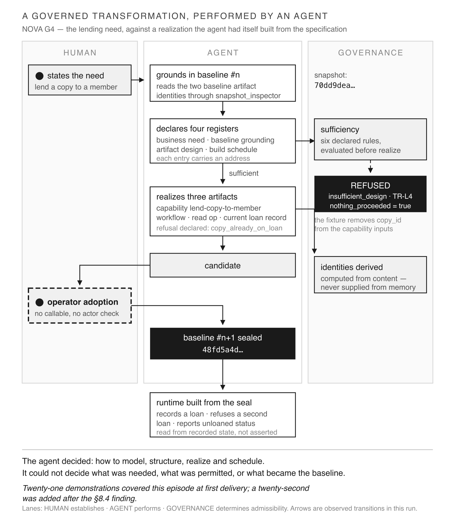{width=6in}

### 7.1 Case and setup

The transformation, recorded as `G4`, adds a lending capability to a realization the worker had
itself built from the frozen specification. It grounds in baseline `70dd9dea…` at family revision
`f476ea5c…`, under profile `NPP-E`, and produces the sealed successor `48fd5a4d…`.

The setup has a property that must be stated rather than glossed. **The worker had built the system
it was transforming, and no input firewall was in force for this gate.** That is deliberate. The
earlier gates asked whether the specification alone was sufficient to build from; this one asks a
different question — whether the *governed state* carries what evolution requires, or whether a
transformation succeeds by drawing on what its author remembers. A firewall would have tested the
wrong thing.

We therefore do not describe this run as independent. It is agent-mediated, and this paper reports its
dependencies: the worker built the subject, a different model evaluated it, and the commission
preceded the run.

### 7.2 What the agent did

The worker declared four registers: the business need, the baseline grounding, the artifact design,
and a dependency-respecting build schedule. Each entry carries an address.

Three properties of how it worked are the substance of this case, and each was checkable after the
fact.

**It grounded by querying, not by recalling.** The transformation reads the baseline through the
inspection surface — `inspection.get_artifact`, `inspection.enumerate_artifacts` — rather than
assuming what the baseline contains. The grounding register names the two baseline artifacts by their
actual identities.

**It invented no vocabulary.** The design uses only kinds the profile admits: `workflow`,
`capability-contract`, `read-operation`. No kind was introduced for the new domain.

**It derived every identity through the system's own functions**, supplying none from memory.
Artifact identities and the resulting snapshot identity are computed from content by the
realization's own code.

The recorded interactions are consistent with querying rather than recall. The transformation's
coupling to the realization is to mechanism — artifact construction, snapshot building, inspection,
refusal — and no governance content appears in it that was not read from the baseline. The trace shows
what was queried; it cannot show that nothing was recalled, and we do not claim it does. A
transformation runs inside the realization and is not a separate program obliged to rediscover it.
That distinction is what this gate was testing.

### 7.3 Sufficiency and refusal

Six rules evaluate the design before any artifact is written, declared as data and evaluated without
short-circuiting. The check kinds are a closed set — `non_empty`, `exact`, `baseline_artifact_exists`,
`contains` — and an unknown check kind refuses hard.

Three refusal paths were demonstrated. A fixture removing `copy_id` from the capability inputs
produces `insufficient_design`, finding `TR-L4`, with `nothing_proceeded = true`; the demonstration
establishes that the refusal precedes any write. A fixture supplying `snapshot:wrong` produces the
`TR-15` `baseline_identity_mismatch` refusal. A fixture altering the declared baseline identity fails
`TR-L2`.

All three are construction refusals in the classification of Section 3.2: they prevent formation of a
candidate after the phase has been entered. All three are exercised by deliberately constructed
fixtures, not by candidates the worker produced and governance rejected. That distinction matters for
what the observations support, and Section 8 keeps it.

### 7.4 Successor baseline and runtime behaviour

The successor contains the two baseline artifacts plus three realized ones: a capability contract
`lend-copy-to-member` with inputs `copy_id` and `member_id`, effect `record_loan` and declared refusal
`copy_already_on_loan`; a workflow of the same name; and a read operation reporting the current loan
record for a named copy.

Fig. 13 shows the difference. The two carried artifacts retain their identities: the transformation
extended the baseline rather than rewriting it, and that is checkable by comparison rather than by
assertion.

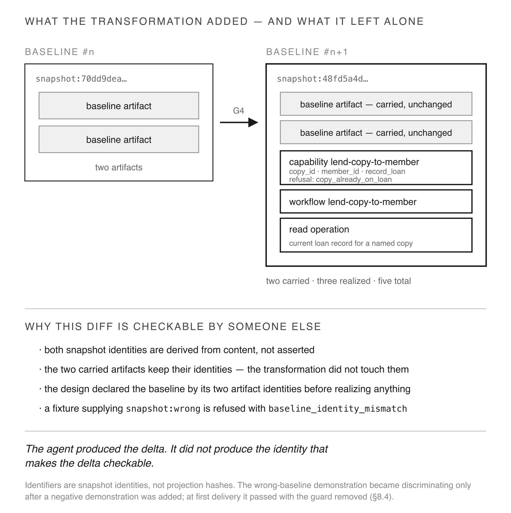{width=6in}

A runtime constructed only from the resulting sealed snapshot then exercised the behaviour. It
verified that the snapshot carries the capability and the named read operation, recorded a loan for
`copy-1` to `member-1`, returned the status by reading recorded state, refused a second loan of
`copy-1` to `member-2` with `copy_already_on_loan`, and established an unloaned status for `copy-2`
by reading the same loan record, which at that point held an entry for `copy-1` only. The unloaned
result is a negative control rather than a default: the same read path returns the on-loan status for
`copy-1` in the same run, so the differing answer is produced by the record's contents.

Twenty-one demonstrations were run at first delivery — fourteen exercising the transformation, seven
the realization it extends — covering evolution, pre-write refusal, exact grounding, per-rule refusal
capability, unknown check-kind rejection, declared routing, runtime success and refusal, unloaned
status, and same-answer determinism. A twenty-second was added after the finding reported in
Section 8.4: a supplied-baseline refusal, which is not part of the first delivery.

## 8 Results: authority separation and evidence adequacy

This section reports results per research question, and places each claim on the rung of Section 3.2 its
evidence supports.

### 8.1 RQ1 — Activity autonomy

The worker executed the exercised transformation path of the lifecycle, under the supplied realization
and harness, for one governed change. It declared the design registers, grounded in the frozen
baseline, and produced a candidate. The
candidate then passed compilation and sealing to become a successor baseline whose identity derives
from its contents. The worker performed neither transition, and no promotion operation ran; 5.5 states
that limitation. Twenty-one demonstrations passed at first
delivery and twenty-two pass now. The evaluating side re-ran them from the retained
artifacts,
which makes it a reproduction rather than an independent replication.

**Rung: observed**, for the exercised path and for that endpoint. The activities the lifecycle
assigns to the worker were carried out by the worker under the governance in force, inside a
realization the worker had itself built and a harness supplied to it. *Executed the exercised path*
is the claim; an independent agent-capability result is not, and the stronger reading is out of RQ1
by construction.

This does not establish that an arbitrary agent could perform them, that this worker would succeed on
a different change, or that the result is correct, secure or useful beyond the behaviours
demonstrated; the conditions bounding the case are stated in Section 7.1.

### 8.2 RQ2 — Authority separation

Four boundaries, reported separately, and each against the same four questions: was an attempt made,
was a refusal observed, was the demonstration discriminating, and what remains untested. Table 5
carries the matrix; the text states what each row supports and what it does not.

**Table 5** RQ2 boundary matrix. For each authority boundary: the stimulus applied, whether an attempt was made, whether a refusal was observed, whether the demonstration discriminates against removal of the guard, the rung reached, and what remains untested.

| Boundary | Stimulus applied | Attempted | Refusal observed | Discriminating | Rung | Untested |
|---|---|---|---|---|---|---|
| Baseline integrity | carried-identity comparison; `snapshot:wrong` fixture | yes | yes — `baseline_identity_mismatch` | yes, after the §8.4 repair | **observed** | a direct write to a sealed baseline |
| Behavioural determination | runtime built only from the sealed snapshot; duplicate-loan case | yes | yes — `copy_already_on_loan` | yes | **observed**, for the exercised capability and read operation | absent route; undeclared state; runtime governance change |
| Scope | none | no | — | — | **declared** | every scope-change path |
| Promotion | none — no promotion operation exists, §5.5 | no | — | — | **declared**, no enforcement point | whether an agent with operator access could seal a successor |

Two boundaries reached *observed*, and only for the stimuli applied. Two remain *declared*. An absent
attempt is not a boundary that held.

**Baseline integrity — observed, for identity comparison and one refusal.** The two artifacts carried
across the transformation retain their content identities, so the transformation extended the baseline
rather than rewriting it, and that is checkable by comparison rather than by assertion. What an
unchanged identity establishes is unchanged content under the declared identity view; it is not by
itself a statement about unchanged behaviour. A fixture
supplying `snapshot:wrong` is refused with `baseline_identity_mismatch`, and following the repair
reported in 8.4 that demonstration fails when the guard is removed. No direct write to a sealed
baseline was attempted. The observation supports *grounding is checked and a wrong baseline is
refused*. It does not support *a write is impossible*.

**Behavioural determination — observed for the exercised capability and read operation.** The runtime
was constructed only from the sealed snapshot. It verified that the snapshot carried the capability
and the read operation before exercising them, returned an on-loan and an unloaned status from the
same recorded state, and refused a duplicate loan with the declared refusal. For that case the
outcomes are determined by the retained sealed inputs, declarations and runtime rules. Fig. 9 states
five separate prohibitions, and this case bears on two of them: no inferred behaviour and no supplied
default. The other three were not stimulated — no route absent from the snapshot was attempted, no
undeclared state was supplied, and no runtime governance change was attempted.

**Scope — declared, not exercised.** The profile fixes what is governed. The run contained no
scope-change attempt and no fixture required one, so this study contains no observation of a
scope-change being refused. The absence of an attempt is not evidence that an attempt would fail.

**Promotion — declared, and weaker than the other three.** Section 5.5 establishes that promotion is
not a distinct operation in the implementation. This run therefore observed an act outside the
worker's run, not an enforcement mechanism that would prevent the worker from performing it given the
operator's access.

Two boundaries reached *observed*, and only for the stimuli actually applied. Two remain *declared*,
and of those, promotion has no enforcement point in the implementation at all. We report this rather
than presenting the architecture's prohibitions as evidence of prevention.

The sealing caveat of 3.1 applies to every row: these observations distinguish the worker from other
actors within the realization, and authenticate none of them.

### 8.3 RQ3 — Independent inspectability

A reader with the retained artifacts can establish the following without access to the worker or the
operator: the baseline identity the transformation grounded in; the artifacts carried forward and
their unchanged identities; the artifacts realized and their content-derived identities; the successor
snapshot identity; the rules each admission was evaluated against; and the refusals with their causes
and blocked transitions.

**Rung: reachable.** The retained artifacts are sufficient for a reader to perform that
reconstruction, and the inspection operations that would perform it carry declared identities. No
blind reconstruction was carried out: no evaluator was given only the retained artifacts, asked a set
of questions fixed in advance, and had the answers and any discrepancies recorded. Independent
inspectability is established here as a property of the retained surface, not as an observed result,
and 10.2 records the omission as a limitation.

**One retained record is inconsistent with the artifacts it describes.** `transformation_evidence.md`
carries a superseded transformation identity, `f4220813…`, that re-running the retained code does not
reproduce; C.1 records it as superseded by `48fd5a4d…` and states the relation explicitly. A reader
reconstructing from the artifacts — the retained code, the sealed successor, the carried identities —
reaches `48fd5a4d…`, so the reconstruction is not blocked. But a reader who took the evidence note as
authoritative over the artifacts would reach the wrong identity, and the retained set does not agree
with itself at that point. RQ3's *reachable* rung is therefore a claim about an artifact set with one
named inconsistency in it, not about a record set that is internally consistent. Regenerating the
evidence record from the final retained artifacts is the repair; it was not performed, and the
superseded record is preserved and labelled instead.

The record supports *the record states that X occurred*, not *an authenticated actor performed X* —
the distinction RQ3 draws in 3.1. Content-derived identity detects alteration of retained content and
permits comparison of successor artifacts; it is not a signature.

### 8.4 RQ4 — Evidence discrimination

Six mutation instances, across five guard families, targeted properties the profile requires,
and the demonstrations offered as evidence for those properties were re-run. Table 6 gives the
ledger.

**Table 6** The mutation ledger. For each mutation: the exact edit applied, the demonstration suite it was applied to, the outcome at first delivery, the outcome after a negative demonstration was added, and what the result establishes.

Six mutation instances across five guard families — the refusal family contributes two, counted
separately. Fig. 14 carries the discrimination logic; this carries the data. The two centre columns
are separate datasets — the suite as delivered, and the same mutation re-run against the repaired suite. The
second does not validate the first.

| Mutation | Demonstrations at delivery | First delivery | After repair | What it establishes |
|---|---:|---|---|---|
| required SHA-256 digest replaced with MD5 | 6 | all passed | **failed** (7 demonstrations) | non-discriminating at delivery; discriminating once a digest demonstration was added |
| baseline-grounding guard disabled | 21 | all passed | **failed** (22 demonstrations) | non-discriminating at delivery; discriminating once a negative demonstration was added |
| declared routing replaced with an equivalent hard-coded branch | 22 | **failed** | — | discriminating — behaviour demonstrably read from sealed state |
| declared routes map emptied | 22 | **failed** | — | declared routing is load-bearing, not incidental |
| declared refusal removed — `copy_already_on_loan` | 22 | **failed** | — | refusal is demonstrated rather than asserted |
| declared refusal removed — `unknown_check_kind` | 22 | **failed** | — | the closed check-kind set is demonstrated, not asserted |

The first two guards were **present** in the implementation and **required by the profile**; whether
each is correct was not separately established. What the mutation shows is that the demonstrations
offered for them would have passed had the guards been absent. Each row's suite is the scope the
mutation was applied to: the digest mutation is non-discriminating within the realization suite that
claimed the property, and the grounding mutation within the full G4 suite. Selection was
risk-directed, made by the evaluating side after delivery, and not preregistered; no mutation score
over a seeded population is reported. This measures the adequacy of specific demonstrations, not
coverage of the suite.

**The unit is a mutation instance**, not a test and not a guard family: one edit to one guard,
re-run against the suite Table 6 names for it. `M5a` and `M5b` remove two different declared refusals
within a single family and are counted separately, which is why six instances span five families.
Every count in this section is on that unit.

Fig. 14 states the logic the ledger applies: a demonstration that passes when its guard is removed
is evidence of nothing about that guard, however many demonstrations accompany it.

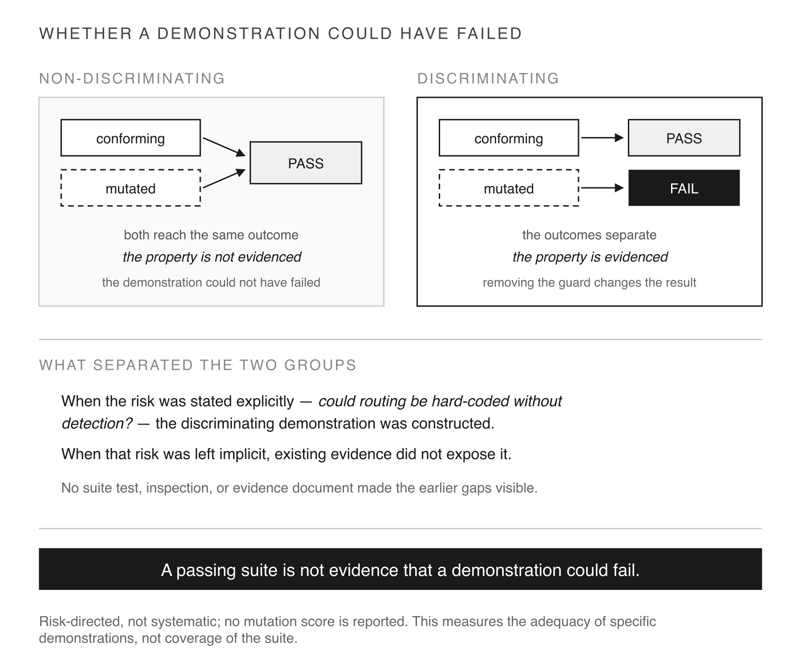{width=6in}

Two datasets are reported, and they must not be merged. The first is the six instances as applied to
the twenty-one demonstrations of the first delivery. The second is the re-run of the failing mutations
against the repaired suite. The second cannot retroactively validate the first, and Table 6 separates
them by column.

Four of the six instances were discriminating: **M3 (declared routing)**, replacing declared routing
with an equivalent hard-coded branch; **M4 (routes map)**, emptying the declared routes map; and
**M5a** and **M5b (declared refusal)**, removing either of the two declared refusal paths. Each caused
the suite it was applied to to fail, which is what makes those demonstrations evidence that behaviour
is read from sealed state.

Two were not. **M1 (digest)** — a required SHA-256 digest replaced with MD5 — left all six
demonstrations of the realization suite passing. **M2 (baseline grounding)** — a baseline-grounding
guard disabled entirely — left all twenty-one demonstrations of the G4 first delivery passing. The
result is therefore `4/6 instances` discriminating, on the unit defined above.

**The two non-discriminating results are the finding of this section, and they are not failures of the
implementation.** Both guards were present in the implementation and required by the profile. Whether
each is correct was not separately established; what the mutation shows is that the demonstrations
offered for them would have passed had the guards been absent. What failed was the evidence. In each case the demonstration asserted a property *about* the system
rather than constructing a case in which the property's absence would change the outcome. A fixture
set containing only well-formed material cannot exhibit a refusal.

The second instance is the more instructive. The profile requires claims about the existing system to
be grounded against the named frozen baseline, and grounding is what separates a real transformation
from one performed against remembered state. The system does ground correctly. The evidence did not
establish that it must.

Two further observations bear on how this generalizes.

**The result does not support a claim that the worker was unable to construct discriminating
demonstrations.** Two other refusals in the same file have negative demonstrations that bite, so the
capability was present in the same work. Why these two did not receive one is not determined by the
evidence: task framing, ordering within the run, and selective construction are all consistent with
what was observed, and the study does not distinguish them.

**Both gaps closed on the first pass after being named** — a post-finding remediation, not evidence
available in the original delivery. A further demonstration supplies a mismatched baseline and
requires the refusal; the mutation was then re-run against the repaired suite and the guard's removal
now fails it, verified by re-running rather than by reading a report. Neither closure required the fix
to be specified. This is a remediation observation about the worker, and it is reported separately
from the mutation result about the evidence.

The pattern across both instances is the same, and it is the paper's most transferable result: a
property can be **declared**, **resolved** and **reachable**, be asserted about in a passing
demonstration, and never reach **discriminating**. A suite that passes is not evidence that any of its
demonstrations could have failed.

Mutation selection was risk-directed and was not preregistered. The five properties were chosen by
the evaluating side from properties the profile requires, after the demonstrations had been delivered,
and expected outcomes were not recorded before the mutations were run. The selection rationale, the
raw outcomes and the point in the sequence at which each repair occurred were recorded, so the
choices are auditable even though they were not blinded; 10.2 reports the same as a threat.

### 8.5 What the realization does not claim

The realization records four matters as outside its claimed scope, and they bound the results above:
full bidirectional governance closure; capability substitutability, effect-path closure and durable
runtime state beyond the single exercised capability; independent profile authorship and genesis; and
the profile's retention parameter. Their distinct statuses — not implemented, not exercised beyond one
case, or outside claimed scope by declaration — are given in Section 10.4.

These are scope statements, not defects discovered by evaluation. They are reported here because a
result section that omitted them would leave a reader to infer that everything the architecture
requires had been exercised.

## 9 Discussion

### 9.1 What changes in human–AI software engineering

The result is not that a human stays in the loop. It is that the loop has a place where authority
lives, and that place is not where the work happens.

That relocates oversight. A reviewer of artifacts faces a workload that scales with generation. A
reviewer of determinations faces one that scales with how much the system's permitted behaviour
actually changed. Under this architecture a large volume of agent output that alters no determination
introduces no new *authorization* decision. The saving is bounded: verifying that no determination changed is
itself work, and volume continues to carry verification, resource, availability, privacy and
operational cost that this model does not address. What changes is the count of authorization
decisions, and that is a property of the object being reviewed rather than of the reviewer's
diligence.

*Bounded autonomy* describes this better than *human in the loop*. Autonomy over engineering activity
can be increased without necessarily transferring authority over executable state. In the model
exercised here it was not transferred.

### 9.2 Relation to code review and LLM judging

Recent work finds that LLM judgement of conformance is unreliable, and that more elaborate prompting
can make it worse. The architecture examined here does not improve that judgement. It reduces what
the judgement can do.

An agent's reasoning in this lifecycle produces artifacts that are evaluated against declared rule
sets, grounded against a baseline it must query rather than recall, and admitted or refused by a
mechanism it does not control. Unsupported reasoning still occurs. It does not become authoritative
by being carried forward.

This is a different response from the one the reliability literature usually pursues. That literature
asks how to make the judgement better. This architecture asks how much should depend on it.

### 9.3 Formal methods and verification

The architecture does not eliminate verification. It changes what must be verified at execution and
what can be established earlier.

Behavioural determination moves into a constrained, inspectable construction phase. What executes is
a traversal of that determination. Formal methods, static analysis, property testing and runtime
monitoring compose with this rather than competing with it — and Section 8.4 is a direct argument for
why they remain necessary. A guard that is correct and never exercised is exactly the case that
verification of the implementation would catch and a passing suite did not.

### 9.4 Generality and portability

Two things should be separable for a reader who rejects this implementation.

The architectural claim is that authorization can be a property of governed state rather than of an
approving act, and that an agent can perform engineering activity without acquiring it. That claim
does not depend on P0–P8, on this compiler, or on content-derived sealing.

The realization is one way of meeting it: declared phases with rule sets, an inspection surface with
declared read identities, refusal rather than repair, promotion separate from construction, and a
snapshot identified by its contents.

Four conditions serve as portability hypotheses for a different architecture: an authoritative
executable baseline, an origin-agnostic admission decision, provenance on derived facts, and promotion
as the sole state change. They are hypotheses, not requirements this study validated. No second
architecture was evaluated, and whether these four are sufficient — or necessary — is open.

What this study establishes is bounded to the realization exercised. What it argues for is not.

## 10 Threats to validity and limitations

Table 7 gathers the limitations below with the surface each one bounds and what remains supported
despite it. The subsections state the ones that need argument.

**Table 7** Limitations. For each: the surface it bounds and what remains supported despite it.

| Limitation | Bounds which surface | What this bounds, and what remains supported |
|---|---|---|
| One worker model | all of §7 — three profile-authoring runs, the realization, the transformation | nothing in this study varies the producer; a second worker against the same scaffold is the single change that would most strengthen the result |
| One authoring run independent of prior context | the sufficiency finding; the other two shared a context | future work |
| No actor outside the scaffold | worker independence is examined *within* a governance scaffold, not against one bypassed | future work |
| **No firewall at the transformation gate** | RQ1 and every RQ2 observation drawn from G4 — the worker had built the subject | deliberate: the gate asks whether governed *state* carries what evolution requires, not whether a specification suffices to build from |
| **Refusals exercised by fixtures** | the three demonstrated refusal paths — none was a candidate the worker produced and governance rejected | supports *the refusal is reachable and discriminating*; not *a worker provoked it* |
| **Promotion has no enforcement point** | RQ2's promotion row — no callable promotes, no actor check gates one | promotion lies outside the agent's reach by deployment, not by an enforced transition |
| **Evaluator degrees of freedom** | RQ4 and the mutation ledger — instruments, classification and selection all sit on the evaluating side | model separation is not evaluator independence; nothing preregistered, selection and outcomes recorded, not blinded |
| **No blind reconstruction** | RQ3 — sufficiency of the retained surface was enumerated, not exercised by a third party | independent inspectability is *reachable*, not *observed* |
| Comparative conformance did not run | the profile excludes the reference implementation by construction | a design question, not a failed run |
| No external effect exercised | the capability surface; the profile selects no interaction boundary | untested, not failed |
| One binding is implementation-specific | the execution claim — dispatch on declared effect value, no declared binding artifact | a known deviation |
| Single-node, unsigned, locally sealed | integrity through content-derived identity, not signature | distributed and multi-party governance unexercised |
| Environment unpinned, governance anchor unversioned | the reproducibility claim | reproduced in the authors' environment with the anchor at `software_governance` `v3`; the build does not enforce that pairing, and independent reproducibility is not demonstrated |
| **One retained record superseded and not regenerated** | RQ3 — `transformation_evidence.md` carries a transformation identity the retained code does not reproduce | the relation is stated (`superseded_by`) and the artifacts still reconstruct to `48fd5a4d…`; the retained set is not internally consistent |
| Overhead unmeasured | no cost reported for compilation, sealing or governed traversal | future work |
| Conditional, cascading, revocable authorization | outside the exercised surface | **not claimed**, not absent |
| Governance is not quality | what a model-backed capability is authorized to do, not what it returns | out of scope by construction |
| Adoption not evaluated | migration cost, operational suitability, comparative economics | out of scope |

### 10.1 Construct validity

This study analyzes authority through five operational indicators: who establishes governing scope, who
promotes a candidate, whether a sealed baseline can be written, whether identity is derived from
content, and whether the runtime traverses rather than determines. Two of the five — scope and
promotion — were not observed in this study, and content-derived identity is an integrity mechanism
rather than authority itself. These are the indicators used to analyze authority separation, not a
definition of authority.

That operationalization misses two things a reader may expect it to cover. It says nothing about the
quality of what an authorized capability returns — governance determines what a capability is
permitted to do, not how well it does it. And it does not capture external effects: the profile
exercised selects no interaction boundary, so no capability producing an effect outside the system was
exercised.

*Outside the worker* is also not *authenticated human authority*. Sealing here is local and unsigned.
The observations distinguish the worker from other actors within the realization; they do not
authenticate any actor, and they do not prevent an operator from altering a record before sealing.

Table 8 states the trust assumptions and capabilities of every party the study names — worker,
commissioning side, operator, compiler, assembler, runtime and governance repository — together with
the attacks the model excludes. The entry that most constrains the results is the operator's: because
sealing is local and unsigned, no artifact in the retained set distinguishes an honest operator from
one who altered a record before it was sealed.

**Table 8** Threat model. For each party the study names: what it is trusted for, what it is not trusted for or where trust is not established, and what it can do in this realization. Attacks excluded from the model follow the table.

| Party | Trusted for | Not trusted for, or not established | Capability in this realization |
|---|---|---|---|
| **Worker** (the agent) | nothing — the design assumes it may emit inadmissible, ungrounded or self-serving material | authorship of the profile; scope; promotion; writing a sealed baseline | full read of the baseline through the inspection surface; authors phase artifacts and construction inputs; submits candidates |
| **Commissioning side** (evaluating model) | writing instruments and classifying findings | independence from the operator — the same operator directed both roles | devises and runs mutations; does not author or promote |
| **Operator** (the human) | establishing scope and the profile; adopting a sealed successor as the next baseline | honesty — sealing is local and unsigned, so a record altered before sealing is indistinguishable from an honest one; no actor check gates adoption | full filesystem and repository access; runs the toolchain; performs promotion by act, not by callable |
| **Compiler** | refusing material that violates the governing surface, and emitting the projection metadata sealing consumes | its own integrity — a modified compiler is not detectable from the artifacts it emits | admits or refuses candidates; resolves the governance surface by location |
| **Assembler** | consuming only compiled projections, and failing hard on a missing, empty or self-inconsistent hash | its own integrity, for the same reason | seals; computes the content-derived identity |
| **Runtime** | traversing only declared nodes, bindings, routes and outcomes | correctness of what was declared; behaviour of any effect outside the system | reads the sealed snapshot; writes only what a declared effect declares |
| **Repository / governance surface** | carrying the declarations the compiler resolves | immutability — the anchor is identified by location, not revision, so a later surface can govern an unchanged source build | supplies the governance surface at build time |

**Excluded from the model.** A malicious operator; a modified toolchain; a compromised host; network
adversaries — the exercised profile selects no interaction boundary; multi-party or distributed
governance; key compromise, since nothing is signed; and denial of service. Content-derived identity
detects alteration of retained content; it is not authentication, and it cannot distinguish an honest
operator from one who altered a record before sealing.

### 10.2 Internal validity

**One worker model.** All five runs used the same model, so nothing in this study varies the
producer. Worker independence is the property the architecture claims and the one this study is least
able to test: a second worker of different capability, run against the same scaffold, is the single
change that would most strengthen the result. No actor operating outside the scaffold is covered
either.

**Context sharing.** Of three profile-authoring runs, only one was independent of prior shared
context; the other two shared one.

**No firewall at the transformation gate.** The worker had built the system it transformed. This was
deliberate — the gate asks whether governed state carries what evolution requires — but it means the
run tests transformation under governance, not construction from a specification.

**Refusals were exercised by fixtures.** Deliberately constructed inputs triggered the three
demonstrated refusal paths, not candidates the worker produced and governance rejected. A refusal
reachable only by a hand-built fixture is weaker evidence than one a worker provoked.

**Risk-directed mutation selection.** Six instances cannot support a coverage or prevalence estimate.

**Evaluator degrees of freedom.** The commissioning and evaluating side wrote the instruments,
classified the findings, chose the five mutated guard families, and knew the claims under test. Using a
different model on that side is model separation, not evaluator independence: the same operator
directed both roles. Nothing was preregistered — neither the mutation selection nor the expected
outcomes — and the sixteenth demonstration was added after the failure had been seen. The selection
rationale, the raw outcomes and the point at which each repair occurred were recorded, so the
analysis is auditable; it is not blinded.

**No blind reconstruction.** RQ3 rests on the sufficiency of the retained inspection surface. No
evaluator holding only the retained artifacts performed the reconstruction under questions fixed in
advance, so independent inspectability is reachable rather than observed.

**One retained record is superseded and was not regenerated.** The run's
`transformation_evidence.md` carries a transformation identity the retained code does not reproduce.
It is preserved as a labelled historical record with the `superseded_by` relation stated (C.1), rather
than regenerated from the final artifacts. RQ3 therefore rests on an artifact set with one named
internal inconsistency; 8.3 reports what that costs.

**Version-sensitive counts.** Register and rule counts are properties of a pinned revision.

**Model attribution is post-hoc.** The operator recorded it after the runs; the harness did not capture
it.

**No comparative conformance run.** The authored profile excludes the reference implementation by
construction, so a direct comparison is blocked by the profile rather than by an implementation
failure.

### 10.3 External validity

Single-node, unsigned, locally sealed. No distributed or multi-party governance. No external effects.
No malicious-operator model. No deployment-scale behaviour, cost, or adoption evidence. Seven domains
in the reference realization and one narrow profile in the independent one.

Two boundaries of the four in RQ2 reached *observed*, and only for the stimuli applied; two remain
*declared*, on the rule stated in 3.2.

What the architecture would need to show next follows directly from that list: repeated
transformations rather than one, more than one worker, adversarial attempts at each boundary rather
than fixtures, an immutably pinned governance revision, a profile selecting an interaction boundary so
that external effects are exercised, and an independent environment reproducing the sealed identity.

### 10.4 Scope limitations

Governance is not quality. Conditional authorization on runtime context, cascading authorization, and
revocation while running lie outside the exercised surface and are not claimed.

The realization itself records four matters as outside its claimed scope: full bidirectional
governance closure, capability conformance beyond the single exercised capability, genesis and profile
authorship, and the profile's retention parameter. These are scope statements rather than defects, and
they bound every result in Section 8.

Adoption conditions are not evaluated. The study establishes architectural properties, not migration
cost, operational suitability, or comparative economics.

## 11 Conclusion

An agent executed the exercised analysis, design derivation, construction and transformation path of
a governed change, under the supplied realization and harness. It queried a sealed baseline rather
than recalling it, used only vocabulary the
profile admits, derived every identity through the system's own functions, and produced a candidate.
Baseline integrity and behavioural determination for the tested case reached the observed rung; scope
was not attempted, and promotion has no implementation enforcement point at which an attempt could be
refused.

For the exercised boundaries, authority over admissibility and sealed executable state was explicit,
inspectable and outside the agent. Scope and promotion remain architectural intent and a fact about
the deployment rather than observed enforcement results.

The result is not that agents are safe because a human is nearby. It is that increasing an agent's
autonomy over engineering *activity* did not require transferring *authority* over executable state,
because the architecture locates that authority in artifacts the agent produces but does not command.

One finding generalizes beyond this architecture, and it is evidentiary. A property can be specified,
implemented, reachable, and asserted about in a demonstration that passes without ever reaching the
discriminating rung. Two required guards in this study were present and undemonstrated; their later
repair is remediation, not evidence available in the original delivery. Governance machinery and
evidence that the machinery was exercised are different properties, and a passing suite establishes
only the first.

## References

DeMillo, R.A., Lipton, R.J., Sayward, F.G.: Hints on test data selection: help for the practicing
programmer. Computer 11(4), 34–41 (1978). https://doi.org/10.1109/C-M.1978.218136

Ganti, B.: Protocol-Governed Computing: an architecture for closed-loop governed transformation.
Preprint, version v1. Zenodo (2026). https://doi.org/10.5281/zenodo.21879948

Jia, Y., Harman, M.: An analysis and survey of the development of mutation testing. IEEE Trans.
Softw. Eng. 37(5), 649–678 (2011). https://doi.org/10.1109/TSE.2010.62

Jimenez, C.E., Yang, J., Wettig, A., Yao, S., Pei, K., Press, O., Narasimhan, K.: SWE-bench: can
language models resolve real-world GitHub issues? In: International Conference on Learning
Representations (ICLR) (2024)

Jin, H., Chen, H.: Are LLMs reliable code reviewers? Systematic overcorrection in requirement
conformance judgement. Autom. Softw. Eng. 33(3), 90 (2026).
https://doi.org/10.1007/s10515-026-00638-5

Kubernetes: Admission control in Kubernetes. The Kubernetes Authors.
https://kubernetes.io/docs/reference/access-authn-authz/admission-controllers/ (2026). Accessed 2026

Newman, Z., Meyers, J.S., Torres-Arias, S.: Sigstore: software signing for everybody. In: ACM
SIGSAC Conference on Computer and Communications Security (CCS), pp. 2353–2367 (2022).
https://doi.org/10.1145/3548606.3560596

OMG: Business Process Model and Notation (BPMN), version 2.0. Object Management Group.
https://www.omg.org/spec/BPMN/ (2011). Accessed 2026

OMG: MDA guide revision 2.0. Object Management Group. https://www.omg.org/mda/ (2014). Accessed 2026

OPA: Open Policy Agent. Cloud Native Computing Foundation. https://www.openpolicyagent.org (2026).
Accessed 2026

OpenSSF: SLSA: supply-chain levels for software artifacts. Open Source Security Foundation.
https://slsa.dev (2026). Accessed 2026

Reproducible Builds: Reproducible builds. https://reproducible-builds.org (2026). Accessed 2026

Ross, S.I., Martinez, F., Houde, S., Muller, M., Weisz, J.D.: The programmer's assistant:
conversational interaction with a large language model for software development. In: International
Conference on Intelligent User Interfaces (IUI), pp. 491–514 (2023).
https://doi.org/10.1145/3581641.3584037

SPIFFE: SPIFFE: secure production identity framework for everyone. Cloud Native Computing
Foundation. https://spiffe.io (2026). Accessed 2026

Torres-Arias, S., Afzali, H., Kuppusamy, T.K., Curtmola, R., Cappos, J.: in-toto: providing
farm-to-table guarantees for bits and bytes. In: 28th USENIX Security Symposium, pp. 1393–1410
(2019)

Vaithilingam, P., Zhang, T., Glassman, E.L.: Expectation vs. experience: evaluating the usability of
code generation tools powered by large language models. In: CHI Conference on Human Factors in
Computing Systems, Extended Abstracts, pp. 1–7 (2022).
https://doi.org/10.1145/3491101.3519665

Yang, J., Jimenez, C.E., Wettig, A., Lieret, K., Yao, S., Narasimhan, K., Press, O.: SWE-agent:
agent-computer interfaces enable automated software engineering. In: Advances in Neural Information
Processing Systems (NeurIPS), vol. 37, pp. 50528–50652 (2024)

## Appendix A: Reproduction guide

### A.1 What can be reproduced, and by whom

A clean rebuild reproduces the sealed identity below **in the authors' environment of A.3, with the
governance anchor resolved to `software_governance` at `v3` (`f7f1422dd062`)**. That pairing is the
condition under which the reproduction claim holds, and the build does not enforce it. Outside it,
exact reproduction is not guaranteed. No independent environment has rebuilt the composition. What is
offered here is a reproduction procedure under a stated contract, not a demonstration of independent
reproducibility; A.5 states the contract and the dependencies that prevent the stronger claim.

### A.2 The composition

Snapshot identity:

> `3e81773ba0090cfdf0040977ebf5d582d4821e3038779a075507edd5ae646328`

| | |
|---|---|
| Claimed profile | `REFERENCE_PLATFORM_PROFILE_V1` |
| Composition ordinal | 15 |
| Constituents | 595 |
| Governed domains | 7 |
| Composition conformance | PASSED — 5 rules evaluated over 410 artifacts |

The seven domains are `ai_governance`, `blockchain`, `book_library_mgmt`, `inspection`, `platform`,
`transformation` and `workload`.

**Identity canonicalization.** The snapshot identity is SHA-256 over a canonical JSON payload of
exactly three inputs, declared in the manifest as `identity_covers`: the domains identity view, every
constituent by path and by the hash of its bytes, and the claimed profile. Observational provenance —
assembly time, and the like — is excluded, and the exclusion is declared. Two assemblies of identical
material therefore seal to the same identity, while any change to a carried file changes it. The
`conformance/` directory is recorded as `post_seal` and is not covered.

### A.3 Environment and dependencies

Python 3.12.10. Core dependencies are `click` 8.4.2, `pyyaml` 6.0.3 and `jsonschema` 4.26.0. Optional
domain cryptography and HTTP libraries are required only when domain capability transforms are
admitted, never by the core compile path. That separation is carried by the packaging rather than
only by convention: the domain distribution declares its cryptography as an installation extra, so
the core toolchain resolves without it.

Each repository's public history is one commit on `main` carrying the tag `v3`, and all ten declare
composition ordinal 15 at that tag. The snapshot's own provenance block records the development
commits it was assembled from; those are local to the authoring workspace and are deliberately not
published, so the tag is what a reader resolves and rebuilds from.

### A.4 Procedure

1. Obtain the toolchain — `protocol_compiler`, `snapshot_assembler`, `protocol_runtime`,
   `snapshot_inspector` — and install into one virtual environment.
2. Obtain the governance surface (`software_governance`) and the workloads
   (`conformance_workloads`, `business_domains`) as separate repositories. **The declarations are
   not shipped in any distribution**; the compiler resolves them from an anchored repository,
   fail-hard and independent of working directory.
3. Compile each domain to a projection: `protocol_compiler/compile.sh`, or `compile_domain.sh` for a
   single domain.
4. Assemble: `snapshot_assembler/assemble.sh`, with `PGC_SNAPSHOT_PROFILE` set — the assembler has no
   default profile, because a profile is supplied from outside the system being constituted and a
   default would have the assembler supply the one condition genesis takes from elsewhere.
5. Compare the resulting `snapshot/manifest.json` identity with A.2.
6. `python .github/process/pgc_env_check.py` asserts that the active interpreter is the intended
   environment and that every package imports.

The G4 dossier of Appendix B is self-contained and needs none of the above: its files are local and
run under `python3 -m unittest test_transform_npp_e test_npp_e`, which reports 22 tests passing.

### A.5 What stands between reproduction and independent reproducibility

**The toolchain installs; the declarations do not.** Nine distributions are published in the 3.0.x
line, each with a wheel and an sdist: eight component packages — `pgc-governance`, `pgc-compiler`,
`pgc-assembler`, `pgc-runtime`, `pgc-inspector`, `pgc-transformation`, `pgc-workloads`,
`pgc-domains` — and `protocol-governed-computing`, which pins all eight to one composition, so
`pip install protocol-governed-computing` obtains the toolchain in one command. Obtaining the
governance surface is a separate step, by the design described in 6.1: the compiler resolves the
declarations from an anchored repository, and no wheel carries them.

**Environment is unpinned** beyond the Python version above. No container image and no lockfile is
published with the composition.

**The governance anchor is identified by location, not by revision.** Nothing in the build pins the
anchored repository to an immutable revision or content identity, so the same source build can resolve
under a later governance surface. Pinning the anchor is the single change that would most improve the
reproducibility claim, and it is not made here.

**The reproducibility contract.** Because the anchor is unpinned, the published tags and the revision
a build actually resolves are different things, and the paper states both:

| | |
|---|---|
| What is published | the `v3` tag in each of the ten repositories of B.1, and the archived composition deposit of A.6 |
| What `v3` establishes | the **source reference** — the revisions a reader resolves and rebuilds from |
| What `v3` does not establish | the sealed identity of A.2, because the compiler resolves the governance surface by location and the build does not check which revision that surface is at |
| The condition the claim is made under | the environment of A.3, with the anchored surface at `software_governance` `v3` (`f7f1422dd062`) |
| What the claim is | under that pairing, a clean rebuild reproduced `3e81773b…` in the authors' environment; outside it, exact reproduction is not guaranteed |
| What a reader must do | establish the pairing manually before comparing identities, because no mechanism in the toolchain establishes it |

A frozen manifest would remove the gap by carrying every repository revision including the governance
anchor, the package versions, the Python version, dependency lock data, and the exact commands. It is
not published with this composition.

### A.6 Data and artifacts availability

**Repositories.** All ten are public under the GitHub organization
`https://github.com/protocol-governed-computing`, one repository per row of B.1, each with a single
commit on `main` carrying the tag `v3` at the commit recorded there. The composition is
`https://github.com/protocol-governed-computing/pgc_release`.

**Archive.** The composition is deposited on Zenodo as *Protocol-Governed Computing: Reference
Implementation (composed platform)*, version `v3`, DOI 10.5281/zenodo.22578424, which names the nine
component deposits as `hasPart` and references the standard at DOI 10.5281/zenodo.22150616. The
component deposits are `software_governance` 10.5281/zenodo.22564615, `conformance_workloads`
10.5281/zenodo.22564783, `business_domains` 10.5281/zenodo.22564704, `protocol_compiler`
10.5281/zenodo.22564884, `protocol_runtime` 10.5281/zenodo.22565005, `snapshot_assembler`
10.5281/zenodo.22565082, `protocol_transport` 10.5281/zenodo.22565441, `snapshot_inspector`
10.5281/zenodo.22565012 and `transformation` 10.5281/zenodo.22565161.

**The archived deposit is one ordinal ahead of the tags, and the paper reports the tags.** The
deposit seals composition ordinal 16, identity
`cb56beb413476f9be6e2b0f4dabc134a9fb072156d1aec5584a5157f98809167`; the component `v3` tags declare
ordinal 15 and rebuild to `3e81773b…`, the identity this paper reports in A.2. All seven domain graph
addresses are byte-identical across the two, over the same 595 constituents and the same 410 protocol
artifacts; the identities differ only because the ordinal is carried in a constituent and every
constituent enters the identity. The deposit's manifest records the cause. A reader comparing against
A.2 must therefore use the `v3` tags, not the deposit's sealed identity.

**Distributions.** Nine distributions are published on PyPI in the 3.0.x line: `pgc-governance`,
`pgc-compiler`, `pgc-assembler`, `pgc-runtime`, `pgc-inspector`, `pgc-transformation`,
`pgc-workloads`, `pgc-domains`, and `protocol-governed-computing`, which pins the other eight to one
composition.

**License and access.** All repositories and deposits are open under Apache-2.0. No access request,
credential or registration is required for any artifact named above.

**The G4 dossier.** The files of Appendix C are local to the `transformation` repository at `v3`
(`33a781068b69`). They are self-contained and require none of the composition build. From the
directory holding `transform_npp_e.py` and `npp_e.py`, run:

> `python3 -m unittest test_transform_npp_e test_npp_e`

which reports 22 tests passing. The mutation edits of D.4 are applied to those same two files.

**What is not archived.** The development revisions from which the composition was assembled are local
to the authoring workspace and are deliberately not published; the `v3` tags carry the publication,
not the development that produced it. No container image and no dependency lockfile is published, and
the governance anchor is not pinned by the build — A.5 states what that costs the reproducibility
claim.

**Figures.** Every figure is an authored diagram, not a plot emitted by a script. Where a figure
carries a count, an identity or a register name — Figs. 6, 7, 11 and 13 — the value is read from the
implementation at the revisions of B.1, and the identities shown are those of A.2 and C.1. Figures 1
to 5, 8, 9, 10, 12 and 14 are conceptual: they state the architecture's intent or the logic of an
argument and report no measurement.

---

## Appendix B: Phase register and rule inventory

### B.1 Pinned revisions

Every count in Section 5 and Table 4 is read from the implementation at composition ordinal 15,
published as `v3`. Counts are properties of a revision, not of the architecture.

Each repository's public history is a single commit on `main` carrying the tag below. Development
revisions are deliberately not published — the remotes carry the publication, not the development
that produced it — so the tag and its commit are the citable pair.

| Repository | Tag | Commit |
|---|---|---|
| `software_governance` | `v3` | `f7f1422` |
| `conformance_workloads` | `v3` | `e7b9feb` |
| `business_domains` | `v3` | `ce134ca` |
| `protocol_compiler` | `v3` | `c6f0fed` |
| `snapshot_assembler` | `v3` | `72f8218` |
| `protocol_runtime` | `v3` | `d9a0050` |
| `protocol_transport` | `v3` | `21046e2` |
| `snapshot_inspector` | `v3` | `0e93efe` |
| `transformation` | `v3` | `33a7810` |
| `.github` (process, profiles) | `v3` | `e6a9c4c` |

All ten repositories declare composition ordinal 15 at this tag. These tags are the **published
source reference**, and checking them out does not by itself reproduce the sealed identity of A.2: the
compiler resolves the governance surface by location rather than by revision, so exact reproduction
additionally requires that the anchored surface be `software_governance` at `v3` — a condition the
reader must establish and the build does not check. A.5 states the contract in full.

### B.2 The nine phases

A **register** is a numbered section of a phase's authoring template. A **rule** is an identified
admissibility rule in that phase's `rules.py`. A **declared prior** is an entry in the phase's
`PRIORS` tuple. **Inspection operations** are the read identities the phase's rule set names.

| Phase | Registers | Rules | Declared priors | Inspection operations |
|---|---:|---:|---|---|
| P0 Change Seed | 20 | 3 | — | — |
| P1 Change Request | 19 | 3 | P0 | — |
| P2 Domain Model Verification | 8 | 5 | P1 | `si.artifact.list` |
| P3 Analysis Loop | 7 | 10 | P2 | `si.artifact.list`, `si.snapshot.summary` |
| P4 Business Model | 7 | 8 | P3 | `si.artifact.list` |
| P5 Business Intent | 8 | 12 | **P0** | `si.artifact.list` |
| P6 Governance Intent | 6 | 11 | P5, **P0** | `si.artifact.list` |
| P7 Design Intent | 20 | **70** | P5, P6, **P0** | `si.artifact.list`, `si.capability.surface`, `si.rule_set.list`, `si.store.list` |
| P8 Authoring Mandate | 7 | 12 | P7 | `si.artifact.list` |

Two conventions matter for checking these numbers. Registers are the numbered sections only:
`Document Contract`, `Stage Inputs`, `Pipeline Provenance`, `Gate 1` and `gov_projection` are
template apparatus and are not counted. Rules are counted by distinct identifier; one P3 rule carries
an identifier without an `intent` string, which is why a search for `intent=` returns nine there and
a search for identifiers returns ten.

The P7 source docstring states *"Sixteen registers"*. The template
`p7_design_intent_template_v0.md` carries twenty numbered registers, from `1. Design Decisions
Resolution` to `20. Refusal — Governance-Surface Discharge`. The template is authoritative and the
docstring is stale.

### B.3 Rule identifiers

Complete for every phase but P7, where seventy identifiers would not repay the space.

**P0** `SYSTEM_BELIEF_AS_KNOWN_FACT` · and two further seed-admissibility rules.

**P3**, ten rules:

- `REUSE_CANDIDATE_NOT_ELIGIBLE`
- `DECISION_WITHOUT_ALTERNATIVES`
- `DECISION_WITHOUT_RATIONALE`
- `CITED_ALTERNATIVE_UNRESOLVED`
- `IMPACT_WITHOUT_EVIDENCE`
- `VERIFICATION_WITHOUT_EVIDENCE`
- `SATURATION_CRITERIA_INCOMPLETE`
- `SATURATION_CLAIMED_WITHOUT_EVIDENCE`
- `BELIEF_RESULT_NOT_REVERIFIED`
- `BELIEF_RESULT_RESTATED_FROM_P2`

The two P3 rules that close the loop back to P2 — `BELIEF_RESULT_NOT_REVERIFIED` and
`BELIEF_RESULT_RESTATED_FROM_P2` — are the mechanism behind the claim in 5.2 that an agent's stated
beliefs are confronted rather than carried: a belief resolved at P2 may not be restated at P3 without
re-verification.

**P7**, seventy rules, of which one inverts the pipeline's citation convention.
`CITED_ARTIFACTS_ABSENT` is the only rule in the lifecycle that reads a *successful* resolution as
the defect: P7 assigns identities that will exist, so a code colliding with something already in the
composition is a silent redefinition rather than a new artifact.

### B.4 Concept, component and responsibility

The detailed inventory behind Fig. 11, which carries the same mapping alongside the artifact flow;
the body retains only the flow explanation.

| Concept | Component | Responsibility |
|---|---|---|
| Governed declaration | `software_governance` | holds the registry and structures that constitute the governance surface |
| Admission | `protocol_compiler` | resolves and validates declarations into domain projections; refuses rather than repairs |
| Sealing | `snapshot_assembler` | composes validated projections into a snapshot carrying a content-derived identity |
| Traversal | `protocol_runtime` | reads the sealed snapshot and executes what it finds |
| Inspection | `snapshot_inspector` | read-only surface with declared operation identities; never writes |
| Governed transformation | `transformation` | implements P0–P8 and the construction stage |
| Conformance | `conformance_workloads` | makes conformance observable |
| Domain behaviour | `business_domains` | supplies the domain implementations the snapshot binds |
| Boundary contracts | `protocol_transport` | ingress and egress contracts; not packaged, and not selected by the exercised profile |

---

---

## Appendix C: G4 run dossier

### C.1 Claim identity

The subject is a governed transformation of the `NPP-E` realization for a lending need, under profile
`NPP-E`. Its identities in full:

Family revision:

> `f476ea5c06506a3efba1d773a5d42818c9190601`

Frozen baseline:

> `snapshot:70dd9deaa723fa3d808d1bcc9d9171244a8e22378a7719961aadde3339dd80cb`

Resulting snapshot, which is also the snapshot the runtime consumed:

> `snapshot:48fd5a4dcf23cebfe5b993a1d576080857a8a7012c5bfcfb83b468b7f7908d5f`

**There is one successor snapshot, not two.** `transform()` returns the sealed successor and
`LibraryRuntime` is constructed from that return value, so the identity the transformation produces
and the identity the runtime consumes are the same value. Re-running the transformation from the
retained artifacts yields `48fd5a4d…`, and that is the current identity of this run.

**A superseded identity is retained alongside it.** The run's own `transformation_evidence.md` records
`f4220813…`, which the retained code does not reproduce: the declared workflow gained its routes
during the execution work, and the evidence note was not restated when the content changed. That note
is retained deliberately, as a labelled historical record of an earlier state of the run rather than
as a competing account of the current one, and the relation between the two identities is stated
rather than left for a reader to infer:

| Identity | Status | Relation |
|---|---|---|
| `f4220813…` | **superseded** — recorded in `transformation_evidence.md` before the declared workflow gained its routes | `superseded_by` `48fd5a4d…` |
| `48fd5a4d…` | **current** — reproduced by re-running the retained code, and the identity `LibraryRuntime` consumed | supersedes `f4220813…` |

The evidence record was not regenerated from the final retained artifacts, so the retained set is
internally inconsistent at this one point. Section 8.3 reports what that costs RQ3, and Section 10.2
carries it as a limitation. As with the demonstration counts in the mutation ledger, the artifacts are
reported and the discrepancy is named rather than reconciled silently.

The run claims a governed transformation and a business-behaviour demonstration. It does not claim
full `NPP-E` transformation, runtime, evidence, or system-instance conformance.

### C.2 Roles

| Role | Model | Harness |
|---|---|---|
| Worker — authored the profiles, built the realization, performed the transformation | Claude Haiku 4.5 | GitHub Copilot |
| Commissioning and evaluating side — wrote the instruments, classified findings, devised and ran the mutations | Claude Opus 5 | agentic coding harness |

No sampling parameters were set by the operator in either harness. All five worker runs — three
profile authorings, the realization, and this transformation — used the same worker model. The operator
recorded model attribution after the runs; the harness did not capture it.

### C.3 The four declared registers

`sufficient_design()` in `transform_npp_e.py` supplies `need`, `grounding`, `design` and `schedule`.
Each register declares `entries`, `empty` and `rung`; each entry carries an address.

- **`need`** — the business need in one statement.
- **`grounding`** — the baseline named by identity and family revision, and the two baseline
  artifacts named by their actual identities, obtained through `Inspection.get_artifact` and
  `Inspection.enumerate_artifacts`.
- **`design`** — capability contract `lend-copy-to-member` with inputs `copy_id` and `member_id`,
  effect `record_loan` and declared refusal `copy_already_on_loan`; workflow of the same name; read
  operation reporting the current loan record for a named copy.
- **`schedule`** — a dependency-respecting build order.

### C.4 Sufficiency evaluation

Six rules are declared as data and evaluated without short-circuiting, before `_realize` is called.
The check-kind set is closed — `non_empty`, `exact`, `baseline_artifact_exists`, `contains` — and an
unknown check kind refuses hard.

| Rule | What it requires | Fixture that defeats it |
|---|---|---|
| `TR-L1` | the need statement is non-empty | empty `statement` |
| `TR-L2` | the declared baseline identity is exact | `baseline_snapshot_id` set to `snapshot:wrong` |
| `TR-L3` | each grounded artifact resolves in the baseline | `artifact:missing` |
| `TR-L4` | the capability declares `copy_id` | `copy_id` removed from inputs |
| `TR-L5` | the capability declares `member_id` | `member_id` removed from inputs |
| `TR-L6` | each schedule entry names a target | empty `target` |
| `TR-15` | the *supplied* baseline matches identity and family revision | a baseline object whose `id` is `snapshot:wrong` |

`TR-15` is evaluated in `evaluate_design` before any rule in the table above, and it is the guard the
mutation study found undemonstrated at first delivery.

Three refusal paths are exercised in the demonstrations. All three are construction refusals in the
classification of 3.2, and all three are triggered by deliberately constructed fixtures rather than
by candidates the worker produced and governance rejected.

### C.5 The successor

The result contains the two baseline artifacts, carried with unchanged identities, plus three
realized artifacts: the capability contract, the workflow, and the read operation. Artifact
identities and the resulting snapshot identity are derived by the realization's own functions; none
is supplied from memory.

### C.6 Runtime observations

`LibraryRuntime` is constructed only from the resulting sealed snapshot. It verifies that the
snapshot carries the `record_loan` capability and the named status read operation, then:

- records a loan for `copy-1` to `member-1`;
- returns that copy's status by looking up recorded state;
- refuses a second loan of `copy-1` to `member-2` with `copy_already_on_loan`;
- establishes an unloaned status for `copy-2` from the same record.

The unloaned result is a negative control rather than a default: the same read path returns the
on-loan status for `copy-1` in the same run, so the record's contents produce the differing answer. Execution reads the workflow, start step, binding, capability contract, outcome vocabulary
and route from the snapshot; it does not select a route from payload, from state, or from a
hard-coded branch. An undeclared outcome refuses with `undeclared_outcome`, a missing route with
`unrouted_outcome`, an unknown route target with `unresolved_route_target`.

### C.7 Demonstration inventory

Twenty-two demonstrations across two files, all passing under re-run from the retained artifacts. A
demonstration is one test method. One of them, `every_declared_rule_can_refuse`, runs six sub-cases
(`TR-L1` to `TR-L6`); counted at the sub-case level the suite would be twenty-seven. Every total in
this paper counts test methods.

**`test_transform_npp_e.py` — 15 demonstrations.**

- `sufficient_design_evolves_named_baseline`
- `insufficient_design_refuses_before_writing`
- `grounding_requires_exact_baseline_identity`
- `wrong_supplied_baseline_is_refused` — added after the mutation finding
- `runtime_records_loan_and_refuses_second_loan`
- `execution_routes_declared_failure_outcome`
- `undeclared_capability_outcome_refuses`
- `runtime_status_for_unloaned_copy_is_established`
- `execution_reports_declared_outcome_and_reads_declared_route`
- `unrouted_declared_outcome_refuses`
- `routing_mutation_changes_execution_path`
- `missing_workflow_refuses_execution`
- `same_declared_answers_produce_same_result`
- `every_declared_rule_can_refuse` — six sub-cases, `TR-L1` to `TR-L6`
- `unknown_check_kind_refuses_hard`

**`test_npp_e.py` — 7 demonstrations.**

- `valid_snapshot_is_rederivable`
- `unknown_kind_is_rule_refusal`
- `duplicate_identity_is_rule_refusal`
- `corrupted_snapshot_is_refused_before_inspection`
- `absent_named_artifact_is_refusal_not_empty`
- `deterministic_reconstruction`
- `integrity_algorithm_is_sha256` — added after the mutation finding

The two demonstrations marked above were added after mutation findings and are not part of the
delivery each was written to repair. Appendix C separates the datasets.

### C.8 Setup conditions that bound the case

The worker had built the system it transformed, and **no input firewall was in force**. Section 7.1
gives the rationale and Section 10 reports the resulting limitation. The run is agent-mediated, not
independent.

### C.9 What the run records as outside its claimed scope

Full bidirectional authority-and-subject governance closure is **not implemented**. The profile's
retention parameter is **not met** — the demonstration retains records for the process lifetime only.
Capability substitutability, effect-path closure, independent-runtime comparison and durable runtime
state are **not exercised** beyond the single capability demonstrated. Profile authorship and genesis
are **outside the claimed scope** by declaration: the profile was supplied as an external input and
the realization provides no independent authorship record for it.

---

---

## Appendix D: Mutation ledger and analysis protocol

### D.1 What this appendix is for

The mutation result is the paper's most transferable finding, and it was produced by the side of the
study that also wrote the instruments and classified the outcomes. This appendix records the
selection criteria, the exact edits, the suite each was applied to, and the point at which repairs
occurred, so that the analysis is auditable. It was not blinded, and nothing here was preregistered.

### D.2 Selection protocol

**Who.** The mutations were devised and run by the commissioning and evaluating side, using a
different model from the worker whose demonstrations they defeated.

**When.** After the demonstrations had been delivered, not before. Expected outcomes were not
recorded in advance.

**Criterion.** Risk-directed: each mutation targets a property the profile *requires* and for which
the delivery offered a demonstration. The five families were chosen to span the two guards whose evidence the
evaluators judged most likely to be assertional — a digest algorithm and a grounding check, both
properties a demonstration can assert *about* without constructing a failing case — and three
properties of declared routing and refusal, where discriminating evidence was expected.

**What this design cannot support.** Six instances do not estimate coverage, failure probability, or
the prevalence of inadequate demonstrations. They diagnose the strength of specific demonstrations
against specific guards, and nothing wider.

### D.3 Classification rule

A mutation is **discriminating** for a suite when disabling or altering the guard causes at least one
demonstration in that suite to fail. It is **non-discriminating** when the suite passes unchanged. No
partial credit is recorded: a suite that passes with the guard removed is not evidence that the guard
was exercised, however many demonstrations it contains.

### D.4 The ledger

Six columns of code in a page-width table are unreadable, so the exact edit for each mutation is
given below the ledger rather than inside it. *First delivery* is the suite as the worker delivered
it; *after repair* is the same mutation re-run against the suite once a negative demonstration had
been added.

| # | Mutation | Suite | First delivery | After repair |
|---|---|---|---|---|
| M1 | required SHA-256 digest replaced with MD5 | realization, 6 → 7 | **all 6 passed** — non-discriminating | **1 failure** of 7 — discriminating |
| M2 | baseline-grounding guard disabled | full G4, 21 → 22 | **all 21 passed** — non-discriminating | **1 failure** of 22 — discriminating |
| M3 | declared routing replaced with an equivalent hard-coded branch | full G4, 22 | **1 failure** — discriminating | — |
| M4 | declared routes map emptied | full G4, 22 | **4 errors** — discriminating | — |
| M5a | declared refusal removed — `copy_already_on_loan` | full G4, 22 | **1 failure** — discriminating | — |
| M5b | declared refusal removed — `unknown_check_kind` | full G4, 22 | **1 failure** — discriminating | — |

The exact edit applied in each case:

- **M1** — in `npp_e.py`, `hashlib.sha256(canonical(value))` becomes `hashlib.md5(canonical(value))`.
- **M2** — in `evaluate_design`, the `baseline_identity_mismatch` raise is removed.
- **M3** — in the execution loop, `current = step["routes"][outcome]` becomes
  `current = "loan-recorded" if outcome == "completed" else "loan-rejected"`, which preserves the
  observable behaviour and removes only the dependence on declared state.
- **M4** — the workflow's declared `routes` map is emptied.
- **M5a** — the failure branch is removed from `LibraryRuntime.lend`.
- **M5b** — the hard refusal for an unknown check kind is replaced by
  `results[rule_id] = True; continue`.

M3 and M4 both bear on declared routing and are reported separately because they defeat different
things: M3 leaves the outcome intact and removes the provenance, so a suite that passes it is testing
outcomes rather than where they came from; M4 removes the state itself.

### D.5 Suite composition, and one discrepancy

The full G4 suite is the two demonstration files of the G4 dossier taken together. Its composition across the repair is:

| | Transformation suite | Realization suite | Total |
|---|---:|---:|---:|
| G2 close | — | 6 | 6 |
| G4 first delivery | 14 | 7 | 21 |
| After the grounding repair | 15 | 7 | 22 |

The run's own evaluation record describes this as *"16 demonstrations now, from 15"*. The retained
files do not bear that out: the transformation suite contains fifteen test methods, of which the
added negative demonstration is one, giving fourteen before the repair. Where the record and the
retained artifacts disagree, this paper reports the artifacts, and the discrepancy is noted here
rather than resolved silently.

### D.6 Where the repair falls in the sequence

For each non-discriminating result the order was: delivery, mutation, finding, repair, re-run of the
same mutation against the repaired suite. Both repairs closed on the first pass after the gap was
named, and neither closure required the fix to be specified. Verification was by re-running the
mutation, not by reading a report.

The repaired result is a remediation observation. It does not validate the delivery it repaired, and
Table 6 and 8.4 keep the two apart.

### D.7 What the result does and does not license

It licenses: a property may be **declared**, **resolved** and **reachable**, be asserted about in a
passing demonstration, and never reach **discriminating**; and a suite that passes is not evidence
that any of its demonstrations could have failed.

It does not license a claim about why the two demonstrations were inadequate. Two other refusals in
the same file carry negative demonstrations that bite, so the capability was present in the same
work; task framing, ordering within the run, and selective construction are all consistent with what
was observed, and this study does not distinguish them.

---
