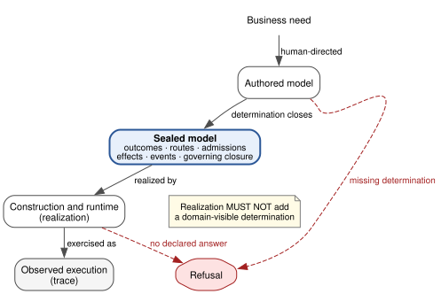
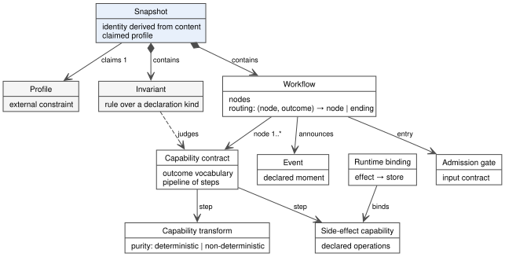
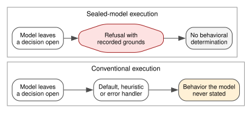

# Behavioral Authority in Sealed Models: Execution Semantics and Governed Evolution

**Bhash Ganti**

Independent researcher · bachipeachy@gmail.com · ORCID [0009-0007-3810-6520](https://orcid.org/0009-0007-3810-6520)

## Abstract

Model-driven systems execute models, but the model does not always determine every behavior. A generator, build step or runtime may supply a default, route or recovery path that the model never declared. This paper asks whether a sealed model can be the authority for all domain-visible decisions, leaving construction and execution only to realize what the model specifies. We define six classes of domain-visible decision and introduce the *sealed behavioral model* as their authoritative source. We give a step-level execution semantics: the runtime reads routes and effects from the sealed model and refuses when the model is silent. We state three properties for a conforming realization—determination closure, non-addition and recoverability—and derive checkable obligations for construction, the runtime and the trace. As supporting context, we describe a discipline for changing models by deriving each successor from a named, frozen predecessor.

We evaluate one open reference realization, Protocol-Governed Computing, across four application domains. The experiments test attribution, tampering, omission and replay. On the exercised paths, every recorded decision is attributable to the sealed model, and acceptance refuses all tested snapshot alterations. The evaluation also identifies places where the realization falls short of the semantics. The obligations pinpoint each gap, and an omission experiment detects a failure that attribution alone would miss. These results from one realization support the feasibility of using a sealed model as the boundary for behavioral determination. They also identify the checks a realization needs in order to conform.

**Keywords:** executable models; model semantics; underspecification; model evolution; traceability; refusal semantics

## 1. Introduction

### 1.1 Models that execute but do not decide

Model-driven engineering moves behavior out of code and into models (Brambilla et al. 2017). Teams declare workflows, states and constraints, and tools derive a running system from those models. The promise is that the model specifies what the system does.

That promise often breaks at the edges. Suppose a model leaves an outcome without a route. A code generator may emit a default branch; an interpreter may log the case and continue; or a runtime may retry, fall back, or raise an exception for a framework to handle. Each response determines what the system does, even though the model did not specify it.

The field recognizes this gap. A review of open problems lists consistency between models and code, along with trust in tools, among the grand challenges (Bucchiarone et al. 2020). Generated code can widen the gap: teams can produce implementations faster than they can inspect them, allowing undeclared decisions to enter a system unnoticed.

This paper takes a narrow position. Rather than asking how to generate better code, we ask whether every domain-visible decision can be settled in the model. If so, construction and execution would only realize decisions the model already contains.

### 1.2 Determination, realization and observation

It is useful to distinguish three activities:

- **Determination** decides what the system is authorized to do. The model holds it.
- **Realization** turns that authorized behavior into running machinery. Construction and the runtime perform it.
- **Observation** records what one execution actually did. The trace holds it.

A network failure during a run is an observation, not a new business behavior; the model need not declare it. A runtime that routes the failed request to an alternate path is different: that route determines behavior. If the model did not declare the route, the realization has made a determination.

Figure 1 shows the boundary we study. The authored model settles each determination, and the realization executes what the model specifies. If a determination is missing, the system refuses instead of supplying one.

**Fig. 1. The behavioral determination boundary.** The sealed model holds every domain-visible determination. Construction and the runtime realize it, and the trace records what one execution did. A missing determination ends in refusal. Realization never supplies it.

### 1.3 Research questions

The central question is:

> Can behavioral determination be closed at the model boundary, so that construction and execution realize a sealed model without adding domain-visible behavior?

We answer it through four research questions:

- **RQ1.** To what extent can execution decisions be attributed to declarations in a sealed model?
- **RQ2.** Can a model change be derived from a named predecessor without modifying that predecessor or introducing undeclared behavioral meaning?
- **RQ3.** Can non-deterministic capability results be prevented from directly determining routing?
- **RQ4.** What discrepancies between the semantics and their realization does the evaluation expose?

### 1.4 Contributions

The paper makes three contributions and describes one supporting discipline:

1. **A sealed behavioral model.** We define domain-visible behavior as a finite set of decision classes, specify behavioral authority over those classes, and present a metamodel for representing them.
2. **Execution semantics and conformance obligations.** We give step-level rules that require the runtime to read routes and effects from the sealed model and to refuse when the model is silent. We state three properties for a conforming realization and derive obligations that construction, the runtime and the trace can each check.
3. **A diagnostic evaluation.** We test one open reference realization against those obligations across four application domains, one reference workload and two self-application cases. The experiments cover attribution, tampering, omission and replay. They show which obligations the realization meets on the exercised paths and identify two it does not yet meet.

As supporting context, Section 5 describes a governed evolution discipline: each model change derives a successor from a named, frozen predecessor. We evaluate this discipline only to the extent required by RQ2.

Throughout, we distinguish two kinds of statements. The semantics and obligations are **normative**: they specify what a conforming realization must do. The evaluation is **empirical**: it reports what one realization did.

### 1.5 Prior disclosure

The realization is part of Protocol-Governed Computing (PGC). The author has five related works:

- **Ganti 2026a, 2026b and 2026c** are preprints on the execution architecture, the transformation architecture and the realization. This paper uses their concepts and cites them. It reuses no text, figures or results from them.
- **Ganti 2026e** is a preprint on the lifecycle architecture, not under review anywhere. This paper restates several of its ideas in new text: closed-world governance (Section 3.4), acceptance, traversal and refusal (Sections 4.2–4.4), the table of three activities (Section 4.1) and the evolution discipline (Section 5). It reuses no text passages, figures or evaluation artifacts from it.
- **Ganti 2026d** is under review at another journal. It studies AI agents that perform engineering work under this architecture and evaluates them with a mutation study. This paper shares no research question, experiment or data with it.

This paper is new in four respects: it defines the six decision classes and gives Definition 1; provides step-level semantics; derives conformance obligations; and reports the experiments and results in Section 6, including the running example.

## 2. Background and Running Example

### 2.1 Underspecification in executable models

An executable model needs a semantics that defines what each element means at run time. Executable UML and its foundational subset specify such semantics for a subset of UML (Mellor and Balcer 2002; OMG 2011). Model interpreters and code generators then realize that meaning.

Every executable modeling approach must also define what happens when the model is silent. Common responses include:

- The language supplies a default, such as an implicit else branch or a default transition.
- The generator supplies hand-written code at a protected region.
- The runtime supplies a policy, such as retry, skip or exception propagation.
- The modeler marks the gap as deliberate, as partial models and modal transition systems do (Larsen and Thomsen 1988; Famelis et al. 2012).

The first three responses move a decision outside the model. The fourth deliberately leaves it open, which is useful for design-time reasoning. None requires refusal when an executing model leaves a decision open. This paper studies that response: a sealed model treats an unresolved behavioral decision as grounds for refusal. Section 7 compares these approaches.

### 2.2 Running example: a book catalog

Our running example is a library catalog from the evaluation. Its workflow, `WF_REGISTER_BOOK_V0`, registers a new book in a single act:

1. An admission gate checks the request against a declared input contract. It yields ACK or NACK.
2. A contract confirms that the requester is authorized staff.
3. A contract validates the submission.
4. Three contracts claim identities for the work, the edition and the physical copy.
5. Two contracts register the edition and the copy.
6. A contract appends the operation to an append-only log.

Each contract declares its possible outcomes, such as SUCCESS, ALREADY_EXISTS, VIOLATION or BACKEND_ERROR, and the workflow declares a route for each outcome. The route for ALREADY_EXISTS on a work identity continues: an existing work can have a new edition. The route for ALREADY_EXISTS on a copy barcode rejects the request: each barcode identifies one copy. These are business decisions stated by the model, and the runtime may not change them.

We return to this example throughout the paper. Section 3 represents it in the metamodel, Section 4 executes it, and Section 5 describes its evolution through change requests. One change request halted; Section 6.5 explains why.

## 3. Sealed Behavioral Models

### 3.1 Domain-visible behavior

A claim that a model decides "all behavior" invites an obvious objection: CPU scheduling, network loss and disk latency affect a system, but no model declares them. We therefore limit our claim to a defined behavioral surface.

**Domain-visible behavior** is the set of decisions a system makes or enacts that matter to its domain. We fix six decision classes:

| Decision class | What is decided | Example from the catalog |
|---|---|---|
| Admission | whether a request enters the workflow | the gate's input contract holds |
| Outcome | which declared outcome a capability reports | the copy barcode already exists |
| Route | which node or ending follows an outcome | ALREADY_EXISTS on the barcode rejects |
| Effect | which declared write or external operation occurs | append the operation to the log |
| Event | which declared moment the system announces | a book was registered |
| Captured input | which declared non-deterministic source is consulted, and that its result is recorded before judgment | a language model's offered words |

The captured-input class needs clarification. The model does not choose a non-deterministic value. Instead, it authorizes the source, requires the value to be recorded, and permits routing only after a deterministic step judges that value. The decision in this class is therefore the authorization and recording—not the value itself.

These six classes are exhaustive only for the claim made in this paper; we make no claim about behavior outside them. They provide an operational vocabulary for the domains studied, not a universal taxonomy of domain behavior.

Failures and external responses also fall within these classes. A storage failure, timeout or refusal from an external service reaches the model as an outcome declared by an operation. The model must then specify what happens next, as an outcome or route decision. A retry or fallback is itself a route and must also be declared. Section 4.1 formalizes this requirement at the step level.

Everything else lies outside our claim. This includes scheduling, timing and resource exhaustion that never surface as declared outcomes. A realization may record some of them as observations, such as timestamps, but they do not select any of the six classes of decision.

### 3.2 Behavioral authority

We can now define precisely what it means for a model to decide.

> **Definition 1 (behavioral authority).** A model has *behavioral authority* over a decision when two conditions hold. Declarations in the model determine the decision. Every downstream stage is barred from supplying a different determination.

The definition has two parts. First, the model must contain the decision. Second, later stages—construction and execution—must not override, extend or replace it. A model can meet the first condition and still lose authority: a generator that emits a default branch "just in case" violates the second, even if that branch never runs.

Protocol-Governed Computing aims to give the sealed model authority over all six classes. The evaluation measures how far its realization achieves that aim.

### 3.3 The metamodel

The metamodel provides the vocabulary the evaluated realization uses to state its decisions. Figure 2 shows its core. It is not intended to express every possible software behavior; it represents the six decision classes for the domains in this study.

**Fig. 2. Core of the metamodel.** Every element is a declaration with an identity and a governing kind. A snapshot contains declarations and claims exactly one external profile. Invariants are declarations too, and they judge other declarations at construction.

The main element kinds are:

- **Workflow.** Its nodes form a directed graph. Its routing maps each (node, outcome) pair to a next node or a declared ending.
- **Admission gate.** It states the input contract a request must satisfy.
- **Capability contract.** It declares an outcome vocabulary and a pipeline of steps.
- **Capability transform.** It computes values. It declares its purity: deterministic or non-deterministic.
- **Side-effect capability.** It declares the operations it may perform on state or on the outside world.
- **Runtime binding.** It binds each side effect to a declared store.
- **Event.** It names a moment the workflow may announce.
- **Invariant.** It states a rule over a declaration kind. Construction evaluates every applicable invariant.

The metamodel is itself represented through declarations. Construction admits its kinds, their constitutions and their invariants just as it admits other declarations. Changing the meaning of a kind is therefore a model change subject to the same governance.

### 3.4 Closed-world governance

Construction admits a declaration only after establishing its *governing closure*: the complete set of applicable governing elements, together with their authority and scope. One principle resolves the difficult cases.

> **Principle 1 (closed-world governance).** If construction cannot establish a declaration's governing closure, it refuses the declaration. An unknown closure is not an empty closure.

The opposite interpretation can seem attractive: a missing rule may look like no rule, and no rule may look like permission. But accepting that interpretation allows ungoverned behavior to appear governed. Principle 1 rules this out. Construction refuses if it cannot resolve a reference, identify an authority or bound a rule set.

### 3.5 Sealing and profiles

Construction composes the admitted declarations into a **snapshot** and seals it. Sealing fixes the snapshot's content, from which construction derives its identity. The resulting snapshot has five properties:

- It is **sealed**: nobody edits it after sealing.
- It is **complete**: it enumerates every constituent.
- It is **self-identifying**: its identity is a hash over its content.
- It is **self-describing**: it carries the integrity value of each constituent.
- It is **verifiable**: any party can recompute the identity from the bytes.

A change to any constituent produces a new snapshot rather than modifying the sealed one.

The identity establishes content integrity, not authenticity. A party that holds a trusted identity can detect any change to the content. The identity does not say who authorized it. Someone who replaces the content and every hash produces a new, self-consistent snapshot with a different identity. Trust therefore comes from where a party obtains the identity, such as a published release. The evaluated realization also supports signed snapshots, but the evaluation does not exercise them.

Each snapshot also claims a **profile**, an external constraint that specifies the facilities a composition must include and the choices it restricts. The snapshot claims the profile but does not author it, preventing a model from certifying itself. In the evaluated realization, a published standards family defines what profiles may require (Protocol-Governed Computing 2026a), and the snapshot identity covers the profile's content hash. Editing a profile after sealing therefore makes it inconsistent with the snapshot's claim.

### 3.6 Three determination properties

We express the paper's thesis as three properties. They are requirements for a conforming realization, not theorems about any implementation. Section 4.1 derives checkable obligations from them, and Section 6 reports which obligations the evaluated realization meets.

> **P1 (determination closure).** After sealing, no domain-visible decision remains for construction or execution to supply. Every outcome an operation can report is handled by its step, and every outcome a node can surface has a declared route or a declared ending.

> **P2 (non-addition).** Construction and execution introduce no domain-visible decision that the sealed model does not contain.

> **P3 (recoverability).** Every domain-visible decision the model represents can be recovered from the sealed model alone. Recovery needs no authoring history and no inference made during design.

P1 concerns completeness: the model must contain every decision. P2 concerns preservation: the realization must not add decisions. P3 concerns inspection: a third party must be able to recover every represented decision from the sealed artifact.

P3 concerns declarations, not executions. A separate property, *attribution*, links a recorded runtime event to the declaration that determined it. Attribution requires both P3 and a trace that records the event. Section 4.1 states the trace requirement as obligation T1, and experiment E1 measures attribution. These properties are independent. For example, a realization can satisfy P2 but violate P1 if it waits until execution to refuse a model that construction should have rejected. Section 6.7 reports such a case, as well as a case in which the realization violates P2.

## 4. Execution Semantics

### 4.1 Step-level semantics and conformance obligations

We define the semantics at the level where the evaluation found its sharpest failure: the step and the outcome it receives. The rules specify how a conforming runtime must handle each outcome and yield obligations that construction and the trace can check.

**Syntax.** A sealed model $M$ declares the following.

- A set of outcome codes $\Sigma$, such as SUCCESS, NOT_FOUND, VIOLATION and BACKEND_ERROR.
- For each operation or transform $u$, the outcomes it can report: $\mathit{Out}(u) \subseteq \Sigma$. An operation declares its outcomes, and a storage failure or a timeout is one of them. A transform's outcomes are fixed by the semantics: $\mathit{Out}(t) = \{$SUCCESS, VIOLATION$\}$. The values a transform computes are data, not outcomes.
- For each contract $c$, a pipeline of steps $\sigma_1, \dots, \sigma_k$ and an input-failure outcome $o_{in}(c)$. Each step $\sigma$ names an operation or a transform $u(\sigma)$, lists the outcomes it handles, $L(\sigma) \subseteq \Sigma$, and maps each listed outcome to an action $h_\sigma : L(\sigma) \to \{\mathsf{continue}, \mathsf{exit}\}$.
- A workflow with nodes $N$, declared endings $X$, a start gate with outcomes ACK and NACK, and a partial routing function $R : N \times \Sigma \rightharpoonup N \cup X$. Every node $n$ other than the gate runs one contract, written $c_n$. The workflow graph is acyclic, and every pipeline is finite.
- Admission contracts $A$ and declared effects $E$.

A contract $c$ *surfaces* an outcome to its workflow in three cases: a step ends $c$ with that outcome, the last step completes with it, or it is $c$'s input-failure outcome:

$$
\mathit{Surf}(c) = \{\, o \mid \exists i.\; o \in L(\sigma_i) \wedge h_{\sigma_i}(o) = \mathsf{exit} \,\} \;\cup\; L(\sigma_k) \;\cup\; \{ o_{in}(c) \}
$$

**Configurations.** A run's configuration $(n, i, s, \tau)$ records the current node $n$, the index $i$ of the next step in its contract, the domain state $s$, and the trace $\tau$ accumulated so far. The environment supplies each operation's outcome. It may supply any $o \in \mathit{Out}(op)$, but no other outcome.

**Step rules.** Suppose step $\sigma = \sigma_i$ of the contract at node $n$ runs and the environment reports outcome $o$.

- **(S-continue)** If $o \in L(\sigma)$ and $h_\sigma(o) = \mathsf{continue}$, the run moves to step $i+1$. If $\sigma$ is the last step, the contract ends with $o$.
- **(S-exit)** If $o \in L(\sigma)$ and $h_\sigma(o) = \mathsf{exit}$, the contract ends with $o$.
- **(S-refuse)** If $o \notin L(\sigma)$, the run ends in refusal. No later step runs.

Each step rule appends a step record $\mathit{step}(\sigma, o)$ to $\tau$. (S-refuse) also appends $\mathit{refuse}(\sigma, o)$.

**Route rules.** Suppose the contract at node $n$ ends with outcome $o$.

- **(R-route)** If $(n, o) \in \mathrm{dom}(R)$, the run moves to $R(n, o)$. That is a node, or a declared ending where the run stops.
- **(R-refuse)** Otherwise the run ends in refusal, with no declared answer.

Each route rule appends $\mathit{route}(n, o, R(n, o))$ or $\mathit{refuse}(n, o)$ to $\tau$.

**Effects.** A writing step commits its effect when the operation reports success. Refusal stops the run but does not undo effects already committed; the trace records each committed effect. The semantics do not prescribe compensation. If a model requires compensation, it must declare compensation as a step.

> **Rule 1 (reading, not synthesis).** The runtime reads routes from $R$, step handling from $h$, admission from $A$ and effects from $E$. It never synthesizes any of them. Where they are silent, it applies a refusal rule.

**Obligations.** The properties' step and route requirements reduce to five obligations: three for construction, one for the runtime and one for the trace.

| Obligation | Checked by | Statement |
|---|---|---|
| **C0** acyclicity | construction | every workflow graph is acyclic |
| **C1** step coverage | construction | every step handles every outcome its operation or transform can report: $\mathit{Out}(u(\sigma)) \subseteq L(\sigma)$ |
| **C2** route coverage | construction | for every node $n$ of every workflow in force, $\mathit{Surf}(c_n) \subseteq \{ o \mid (n, o) \in \mathrm{dom}(R) \}$; the start gate routes ACK and NACK |
| **X1** refusal | runtime | the runtime applies (S-refuse) and (R-refuse) and no other rule when $L$ or $R$ is silent |
| **T1** recording | trace | every rule application appends its record, including the outcome of every step |

The rules imply three propositions. Each follows by checking the cases in the rules above, and each concerns steps and routes only.

- **Proposition 1 (closure).** Let $M$ be an accepted model that satisfies C0, C1 and C2. Then no step or route refusal fires, and every run reaches a declared ending. *Proof sketch.* C1 rules out (S-refuse), because every reported outcome is in $L(\sigma)$. C2 rules out (R-refuse), because every surfaced outcome is routed. C0 and finite pipelines bound the length of a run.
- **Proposition 2 (non-addition for steps and routes).** If the runtime satisfies X1, every transition it takes under these rules is one that $h$ or $R$ defines. For any model, it adds no step handling and no route.
- **Proposition 3 (attribution for steps and routes).** If the trace satisfies T1, every application of a step or route rule appears in $\tau$. Each record names the step or node and the outcome, so a reader can attribute it to the declaration it used.

These propositions are deliberately narrow. Proposition 1 separates decision completeness from termination: C1 and C2 ensure that no missing declaration forces refusal, while C0 adds the distinct guarantee of termination. Propositions 2 and 3 cover only the outcome and route classes. Rule 1 also governs admission, effects, events and captured inputs, but we give those classes no transition rules and prove no corresponding propositions. For them, P2 and P3 remain requirements, which E1 tests on the exercised paths.

The obligations divide the work: C0, C1 and C2 make refusal unnecessary; X1 ensures safe refusal when those checks fail; and T1 makes each step and route decision visible.

**A counterexample in these terms.** Section 6.7 reports case O3. Step $\sigma$ = resolve_address uses the registry's RESOLVE operation. $\mathit{Out}(\mathrm{RESOLVE}) = \{$SUCCESS, NOT_FOUND, VIOLATION, BACKEND_ERROR$\}$, but $L(\sigma) = \{$SUCCESS, NOT_FOUND, VIOLATION$\}$, so the model violates C1. When the environment reported BACKEND_ERROR, the semantics required (S-refuse). Instead, the evaluated runtime continued to the next step, violating X1. It also failed to record $\sigma$'s outcome, violating T1. The model and realization therefore both have defects, and the semantics identify the obligation each one violates.

**Other activities.** Construction and evolution also make decisions, but about different subjects. The table distinguishes these three activities. This paper formalizes only execution.

| Activity | State | Proposal | Result | Decides |
|---|---|---|---|---|
| Evolution | a named model | a stated need | the successor model | what the declarations are |
| Construction | admitted declarations | a candidate declaration | a sealed snapshot | which declarations may exist |
| Execution | domain state under a sealed snapshot | a request | the next domain state | what occurs under those declarations |

### 4.2 Acceptance

Execution starts with acceptance. Before running anything, the runtime checks four conditions:

1. **Integrity.** Each constituent hashes to the value the snapshot records for it.
2. **Identity.** The constituent hashes derive the identity the snapshot bears.
3. **Totality.** The snapshot enumerates every file it carries, and every enumerated file is present.
4. **Profile.** The snapshot claims a profile that the accepting context can read, and the composition satisfies it.

If any condition fails, the runtime refuses the entire snapshot. It neither runs the parts that passed nor accepts the snapshot with a warning. These checks make the snapshot an authority boundary, not merely a package of runtime data. Section 6.4 tests each condition through tampering.

### 4.3 Traversal without decision

Capabilities may compute, but they may not route. This distinction is central to the semantics.

At each node, the runtime executes the declared contract according to the step rules in Section 4.1. The contract returns an outcome, and the runtime follows the route $R(n, o)$ to the declared next node or ending. In the catalog example, CC_CLAIM_COPY_BARCODE_V0 returns ALREADY_EXISTS. The runtime follows the corresponding declared route to EXIT_REJECTED. The payload, caller's identity, environment and accumulated state cannot change that route; only a new model can.

The same principle applies to state and effects. Before execution, the model specifies each write, its target store and its conditions. A capability declared without effects cannot acquire one through the runtime or its environment. The runtime binding—not the runtime itself—determines which store receives a side effect.

### 4.4 Refusal instead of default

Under the semantics, each of the following gaps leads to refusal:

- a step outcome its step does not handle;
- an outcome with no declared route or ending;
- a reference that does not resolve;
- a node with no declared admission contract;
- a snapshot that fails acceptance.

In each case, the runtime records why it refused and ends the run. It does not choose a default path, retry by convention or switch to an unspecified mode. Figure 3 contrasts the two responses to the same gap.

**Fig. 3. Two responses to an open decision.** Conventional execution fills the gap and so produces behavior the model never stated. Sealed-model execution refuses and records why. It produces no behavioral determination.

It is important to distinguish a refusal from a declared rejection. A declared outcome such as "rejected" is a route chosen by the model, which the runtime follows. A refusal means the model supplied no answer, so execution cannot proceed. In the catalog, NACK at the gate follows the declared route to EXIT_REJECTED. By contrast, an outcome with no workflow route causes refusal. The trace records these cases differently; Section 4.6 explains how to distinguish them.

Refusal has a cost: a system that refuses where another system degrades gracefully is less forgiving. The semantics accept this cost deliberately. A graceful default is a decision, and this paper asks who is authorized to make it.

### 4.5 Non-deterministic capabilities

Some capabilities are inherently non-deterministic: a language model, clock or random source may return different results on different runs. The semantics permit them under two rules.

> **Rule 2 (capture).** The runtime records a non-deterministic result once, as a *captured input*. Replay substitutes the captured value and does not call the capability again.

> **Rule 3 (judgment before routing).** A captured input never selects a route directly. A deterministic step must judge it first, and only that step's declared outcome routes.

Construction enforces Rule 3 before execution. A contract cannot route directly on a step that invokes a non-deterministic transform, and a composite transform cannot directly emit a result from one. Construction refuses either form. The causal chain is therefore:

non-deterministic capability → captured result → deterministic judgment → declared outcome → declared route.

Rule 2 makes execution reproducible given the captured inputs. Two runs with the same request, state and captured inputs produce the same determinative record. Timestamps and durations may differ as observations, but they never influence a decision.

### 4.6 Traces and attribution

Every execution emits a trace. Its first record identifies the snapshot used for the run. Each subsequent record captures an event: starting a node, running a step, evaluating an admission check, reporting an outcome, taking a route, announcing an event or raising an error. A route record identifies the node being left, the outcome that selected the route, and the destination node or ending. An admission record lists every check and whether it passed. Each check identifies a field and its declared type, but not the field's value. A captured-input record includes the value needed for replay. Obligation T1 further requires every step record to include that step's outcome.

A read-only query, *explain*, joins a trace to its sealed model. It refuses traces that identify a different snapshot because trace addresses are meaningful only within the snapshot that produced them. For an accepted trace, explain reports each visited node, the decision recorded there and the declaration associated with that decision. It distinguishes two kinds of facts: **recorded** facts from the trace (the path, outcomes, checks and captured values) and **joined** facts from the sealed model (each node's declared capability and whether each route is a declared edge).

Explain also classifies each run's ending:

- at a **declared ending**, naming the node and the outcome that decided it;
- with **no declared answer**, where the runtime raised an error because the model did not answer;
- **incomplete**, where the trace records no ending.

Explain uses only the sealed model and the trace; it consults neither authoring history nor design documents. This implements P3. Section 6.4 uses explain to measure RQ1.

## 5. Governed Model Evolution

This section describes the evolution discipline to provide context for RQ2. It governs process rather than model transformation, and this paper does not formalize it.

### 5.1 A named predecessor

A sealed model never changes; evolution creates a new one. Each change starts from a *named predecessor*: the sealed snapshot, identified by its content hash, on which the change is based. The predecessor provides three things:

- the structure the change may reuse;
- the ground truth against which claims about current behavior are checked;
- the identity the successor must account for.

The first model in a system starts from an empty model called genesis. Genesis does not relax any requirements: it must still name an external profile and produce a complete, verifiable model.

For the catalog, each change request records its predecessor's identity in a baseline record. Five change requests have run so far. As the composition gained domains and features, the predecessor snapshots grew from 292 to 478 sealed artifacts.

### 5.2 Staged derivation and preservation

A change proceeds through ordered phases, from the business problem through domain and business models, business and governance intent, and design intent to an authoring mandate. Each phase reads the preceding phases and writes to declared registers. A declared rule set evaluates each phase. In the evaluated realization, 883 rules across 61 check kinds judge the nine phases.

Two rules govern what a phase may say:

- **Preservation.** A later phase must not drop what an earlier phase committed.
- **Non-invention.** A later phase must not state a fact that no earlier phase or the human author supplied.

A check for loss alone is insufficient: an invented fact passes a loss check just as easily as a preserved one. The realization therefore checks both preservation and non-invention.

Only a human-directed author creates meaning. If a value is missing, the process records an open question and assigns it to a named owner. A blocking question makes that phase inadmissible. No tool fills it.

### 5.3 Sufficiency before realization

Before construction realizes any artifact, the design must be *sufficient*. It must fix every fact the artifact needs. A generator that fills a missing fact becomes a second design authority, which is the same failure as a runtime default one stage earlier. So the realization checks sufficiency first, and it realizes each artifact from the design alone.

Sufficiency is not adequacy. A sufficient design can still be the wrong design for the business. The realization therefore also executes each change against real state and observes its declared acceptance criteria.

### 5.4 Replacement and supersession

A successor snapshot replaces its predecessor as the model in force. Nobody edits the predecessor. A *supersession* declaration relates the two exact identities. It is not a redirect. A reference to the predecessor still means the predecessor. Within the new composition, the predecessor becomes unreachable for execution but stays retained and inspectable. Historical evidence therefore keeps its meaning, and an old identity cannot quietly remain in force.

## 6. Evaluation

### 6.1 Method

The study follows design science (Hevner et al. 2004; Wieringa 2014). Sections 3–5 present the artifact—a sealed behavioral model and its execution and evolution semantics. Here, we evaluate that artifact in context through an embedded multiple-case study (Runeson and Höst 2009). Each case is a domain modeled in the reference realization.

This is a feasibility and diagnostic study of a single system. We ask which obligations from Section 4.1 the realization meets on the exercised paths, and whether the experiments detect the obligations it fails to meet. We do not test a second, independent realization.

**Subject.** All measurements concern one composition of the PGC reference realization, published as its `v5` release (Protocol-Governed Computing 2026b):

- snapshot identity `f8356d9c8938aea16ab7850d7bda964d8d16c42c64e5db9056d5fe58040ec1d0`;
- profile `GOVERNANCE_SURFACE_PROFILE_V0`;
- eight composed domains and 827 sealed constituents.

**Procedure.** A single command cleanly rebuilds every domain from source, assembles the composition, and runs all checks and execution workloads. In the evaluated run, all 59 steps produced their expected results. We then ran four experiments on the rebuilt composition and its traces. The supplementary material contains the experiment scripts and raw outputs.

**Experiments.**

- **E1 Attribution.** Explain every trace and test every recorded decision against the sealed model.
- **E2 Tampering.** Alter one class of constituent in a copy of the sealed snapshot, then attempt acceptance.
- **E3 Omission.** Remove one determination from a copy of a domain model, or exercise one the sealed model already omits, then construct and execute it.
- **E4 Evolution and replay.** Examine the change requests, phase judgments and replay checks that the run produced.

### 6.2 Cases

We group the cases by their role in the study. Four are application domains, one is a reference workload, and two are self-application cases in which the realization models its own tooling. The two self-application cases are not independent application domains and are not counted as such.

| Case | Group | Character | Traces |
|---|---|---|---|
| AI governance | application | policy decisions over agent actions and licensing | 2 |
| Book catalog | application | business registers; five change requests | 45 |
| Blockchain identity and wallet | application | stateful registries and append-only logs | 34 |
| Language model | application | a non-deterministic model offers words that rules then judge | 78 |
| Collatz | reference workload | a computation with declared failure routes | 1 |
| Transformation | self-application | the evolution phases, modeled as workflows | 83 |
| Snapshot inspector | self-application | read operations, declared as model elements | — |

The transformation case runs its phase workflows against its design-baseline composition (snapshot `cd8cc3e6…`), so explain checks those traces against that composition. The inspector does not execute and therefore produces no traces; instead, it provides evidence about the metamodel. Its 19 read operations are each represented by a declared pair of boundary contracts. The explain query itself is also declared in the system.

### 6.3 Claims, experiments and oracles

Each experiment tests a stated claim against an oracle that can return a failing result:

| Claim | Experiment | Oracle | Result | Status |
|---|---|---|---|---|
| Every recorded node-level decision is attributed to a declaration (attribution) | E1 | each decision attributed by explain | 3,019 of 3,019 | met on exercised paths |
| An altered snapshot is not executed (acceptance) | E2 | refused at acceptance; the control boots | 9 of 9 refused | met for the tested alterations |
| A missing route is refused before execution (C2) | E3, case O1 | construction refuses | **construction admitted;** execution refused | **violated** |
| No route is decided by a non-deterministic result (Rule 3) | E3, case O2 | construction refuses and leaves no output | refused; no files left | met |
| An outcome a step omits is refused, not continued (C1, X1) | E3, case O3 | execution refuses | **execution continued;** the person was accepted | **violated** |
| Evolution derives from a named predecessor without invention (RQ2) | E4 | inadmissible phases refused; two judgment paths agree | 71 of 71 refused; the paths agree on 83 of 83 | met in the suite |
| Replay reproduces a run from captured inputs (Rule 2) | E4 | determinative records agree | agree | met in one replay |

Table 1 summarizes the results by obligation, distinguishing what the realization meets, what it violates and what the study did not test.

**Table 1. Status of each obligation in the evaluated realization.**

| Obligation | Status | Evidence |
|---|---|---|
| C0 acyclicity | met: construction refuses a cyclic workflow | construction invariant; not exercised by an experiment |
| C1 step coverage | **violated**: construction does not check it; 14 of 73 steps that use an operation handle fewer outcomes; all 98 transform steps comply | outcome survey; O3 |
| C2 route coverage | **violated**: construction does not check it; 11 act outcomes have no route. Every start gate routes ACK and NACK | outcome survey; O1 |
| X1 refusal | met at node level; **violated** at step level, where the runtime continues | O1; O3 |
| T1 recording | met at node level; **violated** at step level, where a step record carries no outcome | trace schema check; O3 |
| Rule 3 judgment before routing | met: construction refuses the shape | O2 |
| Acceptance | met for nine tested alterations; authenticity not tested | E2 |
| Attribution of recorded decisions (P3 with T1) | met for recorded node-level decisions on exercised paths | E1 |

For E1 to detect failures, its measurement instrument must be able to report them. We verified that explain can do so: a fixture trace that takes an undeclared route is reported as such. In case O1 below, explain likewise reports an unrouted outcome. Case O3 reveals the instrument's limit: explain cannot report a decision missing from the trace.

### 6.4 RQ1: Attribution and tampering

**E1.** We measure attribution for each recorded decision on an exercised path. The trace records node-level decisions: admission, contract outcome, route, effects, events and captured inputs. Because the realization does not meet T1, the trace does not record how a step handled its outcome. E1 therefore cannot establish that no unrecorded decisions occurred; case O3 provides an example.

Explain accepted all 243 traces, and every run ended at a declared ending. Of those runs, 206 succeeded. The remaining 37 ended on a declared non-success route: 25 VIOLATION, 8 ALREADY_EXISTS, 3 NOT_FOUND and 1 NACK. Table 2 classifies the recorded decisions.

**Table 2. Recorded decisions by class on the exercised paths, attributed to the sealed model.**

| Decision class | Observed | Attributed | Unattributed |
|---|---|---|---|
| Admission | 243 | 243 | 0 |
| Outcome | 765 | 765 | 0 |
| Route | 1,008 | 1,008 | 0 |
| Effect | 852 | 852 | 0 |
| Event | 85 | 85 | 0 |
| Captured input | 66 | 66 | 0 |
| **Total** | **3,019** | **3,019** | **0** |

We test attribution separately for each class. A route is attributed only if the sealed workflow declares the exact edge: the same node, outcome and target. An outcome is attributed if the declared node names the relevant capability. An admission is attributed if the gate is declared and the trace records its checks. An effect, event or captured input is attributed if the sealed model indexes the declaration it names.

Full attribution is expected by design because the runtime reads each decision from the model. E1 therefore confirms that the realization follows Rule 1 on the exercised paths, but it cannot establish the same for unexercised paths. E2 and E3 test the property more directly.

**E2.** We altered nine constituent classes, each in a separate copy of the sealed snapshot, and attempted acceptance. An unaltered copy served as the control. Table 3 shows the results.

**Table 3. Tampering with a sealed snapshot.**

| Altered | Refused | Condition that refused |
|---|---|---|
| nothing (control) | no | — |
| a routing target in the compiled dispatch table | yes | integrity |
| a canonical capability contract | yes | integrity |
| a published workflow graph, with one edge added | yes | integrity |
| a side-effect declaration | yes | integrity |
| a reference in the artifact index | yes | integrity |
| the identity the manifest states | yes | identity |
| the profile the manifest claims | yes | profile |
| an added file that no constituent list declares | yes | totality |
| a removed constituent | yes | totality |

Acceptance refused every altered copy before execution and identified the failed condition in each refusal. Adding an edge is the most direct test of P2: the altered graph no longer matches its recorded hash, so the added route cannot become part of the sealed model.

**Answer to RQ1.** On the exercised paths, the sealed model accounts for all recorded decisions in the six classes: 3,019 of 3,019 across 243 traces and seven cases. Acceptance refused every tested alteration. Because attribution covers recorded decisions only, these results support conformance on the exercised paths; they do not prove that every decision was recorded.

### 6.5 RQ2: Evolution

**A chain of named predecessors.** The book catalog has undergone five change requests, each of which identifies its predecessor by snapshot identity:

| Change request | Predecessor size (artifacts) | Result |
|---|---|---|
| CR-01: introduce the catalog | 292 | delivered |
| CR-02: extend the catalog | 336 | delivered |
| CR-03: announce every registered moment | 390 | halted at phase 2; resumed and delivered |
| CR-04: tighten admission at the boundary | 395 | recorded at phase 0; not started |
| CR-05: restrict operations to library staff | 478 | delivered |

No predecessor was edited. Each successor is a new snapshot with its own identity. E2 demonstrates that an edited snapshot fails acceptance.

**A refused evolution.** CR-03 is the negative case. The business requirement was for `WF_REGISTER_BOOK_V0` to announce three moments in one act: a work registered, an edition registered and a copy registered. At the time, the metamodel allowed an act to announce only one moment. The change request considered and rejected three possible workarounds:

- announce one moment and leave two silent;
- split the registration act into three;
- extend the design language alone, so the design would declare three announcements while the runtime fired one.

The first two would change the business requirement to fit the tool. The third would make the model declare behavior that the realization could not perform. The change therefore halted at phase 2. A separate, governed change extended the platform's model to support multiple announcements per act. CR-03 then resumed at phase 3 without reopening any design decision.

Rather than approximate a requirement the metamodel could not express, the realization changed the metamodel through the same governed process.

**Phase judgments.** The transformation case contains 83 phase documents across nine phases: 12 admissible documents and 71 deliberately inadmissible ones. Examples of inadmissible documents include:

- an authoring mandate that realizes an artifact the design never determined;
- an amendment the design never placed;
- a design deferral with no named owner.

Two independent paths judge each document. One is a reference oracle with rules declared in code; the other reads the phase's rule set from the sealed snapshot. The paths used identical rule sets and agreed on all 83 verdicts. The realization refused all 71 inadmissible documents. A further suite ran 83 cases as phase workflows through the runtime. Every case produced its expected verdict, including the 69 inadmissible cases.

**Realization from design alone.** For five domains, construction rebuilt 167 artifacts from their change dossiers. Every rebuilt artifact matched its delivered version field for field. A further check examined seven supersession relations from both sides; the two sides agreed on all seven.

**Answer to RQ2.** Every evaluated change derived from a named, unmodified predecessor, and the realization refused every inadmissible phase document in the suite. When the metamodel could not express a requirement, the change halted rather than relying on an invented workaround.

### 6.6 RQ3: Non-deterministic capabilities

In the language-model case, a non-deterministic transform offers candidate next words. A deterministic step judges each offer against declared response rules, and only the step's outcome determines the route. The 78 language-model traces contain 66 captured inputs; all 66 identify the declared non-deterministic transform.

**Case O2.** We modified a copy of the language model's contract so that it routed directly on a step invoking the non-deterministic transform. Construction refused the model under the invariant that prohibits routing on non-deterministic results, and produced no output files. The unaltered copy built normally.

**Replay.** The language-model suite replays a recorded run. Replay reconstructed the response from captured offers without calling the model, and the original and replayed determinative records agreed. In the trace-determinism check, nine determinative fields remained identical across 19 events, while the two observational fields differed as expected.

**Answer to RQ3.** Construction prevented a non-deterministic result from routing directly, and every captured input reached routing only through a deterministic judgment. Replay reproduced a run from its captured inputs. In the evaluated run, a test model declared non-deterministic stood in for a hosted language model. The hosted-model criterion was not exercised (Section 6.8).

### 6.7 RQ4: Discrepancies

The evaluation found seven places where the realization falls short of the semantics. We group them by status below.

**D1, found by this study: construction admits an unrouted outcome.** In case O1, we removed the route for the VIOLATION outcome of the collatz contract `CC_COMPUTE_SEQUENCES_V0`. Construction nevertheless admitted the model, and assembly sealed it. When execution received a payload that triggered VIOLATION, the model provided no answer. The runtime raised and recorded an unrouted-outcome error; it did not invent a route. Explain reported that the declarations had no answer for the run.

D1 illustrates how the three properties can come apart. P2 held because the realization added no behavior. P1 failed because construction sealed a model with a declared outcome but no route. The runtime eventually refused, but only after a request reached the gap. A construction-time invariant could prevent this: every declared outcome of every node must have a route or ending. The gap is not merely hypothetical. A static survey of the evaluated composition found 11 act outcomes without workflow routes, all involving storage failures in the blockchain domain. Two belong to a superseded workflow that the realization no longer dispatches. None of the 11 occurred in the evaluated runs.

**D2, found by this study: the runtime continues past an outcome a step omits.** Each contract step that uses an operation lists the outcomes it handles, while the operation declares every outcome it can report. Construction checks that each listed outcome has a route, but not that the step lists every outcome the operation declares. The survey found that 14 of the 73 steps using an operation listed fewer outcomes than their operations declared. If an operation reports an unlisted outcome, the runtime continues to the next step.

In case O3, we corrupted the contact-address registry in the blockchain identity domain. The registry returned BACKEND_ERROR, which the lookup step in `CC_RESOLVE_ACTOR_V0` does not list. The runtime nevertheless continued, read the person's record and returned SUCCESS from the contract. The workflow then accepted the person. The trace recorded neither the lookup outcome nor the decision to continue. Explain consequently reported a declared ending and no undeclared route.

D2 is an implementation failure. In Section 4.1's terms, the model violates C1, while the runtime violates X1 and T1. The runtime chose what to do after an outcome the model left open, changing the business result. The evaluated realization therefore violates P2 and does not implement the semantics on this path.

D2 also demonstrates the diagnostic value of the approach. Attribution alone could not detect it because the trace omits step outcomes. The omission experiment exposed the failure, and the semantics identified the obligations it violated. The required repairs follow directly: construction must check C1, the runtime must apply (S-refuse), and the trace must record every step's outcome. Although the realization already has an invariant against runtime defaults in step routing, no check enforced it.

**D3, found earlier and corrected: a second, weaker acceptance.** An earlier runtime had its own acceptance check. It recomputed the identity from the per-constituent hashes in the manifest, rather than from the constituent bytes themselves. As a result, it detected a tampered manifest but accepted a tampered constituent. The realization replaced this check with a single acceptance determination shared with the assembler. It recomputes each constituent's hash from its bytes. E2 shows that this check refuses every tested alteration.

**D4, found earlier and corrected: a profile outside the identity.** Previously, the snapshot identity covered the claimed profile's name but not its content. A profile could therefore change after sealing without changing the identity of snapshots that claimed it. The identity now includes the profile's content hash, and a test confirms that acceptance refuses a profile altered after sealing.

**D5, open: admission contracts that disagree with their workflows.** A fidelity check compares each gate's declared input contract with the workflow that uses it. Across 37 gates, the check reports 11 findings. For example, one gate accepts a field that its workflow cannot resolve. The realization reports these findings rather than suppressing them. Because they concern admission, a conforming realization would refuse such a gate during construction.

**D6, open: two advisory checks fail.** Snapshot validation runs ten checks. Eight pass, and two advisory checks fail:

- side-effect declarations published in two domains disagree in all 15 copies examined;
- one of the two bound paths examined is not declared by any store.

These advisory failures do not stop the build, but they remain unresolved and are reported here. The first concerns the effect class and P3: two copies of one declaration could authorize different effects. A conforming realization would refuse that disagreement during construction. The second is a consistency defect in one binding.

**D7, open: profile storage.** The profiles are stored in the same workspace as the compositions that claim them. Although another party authored them and the snapshot identity covers their content, they are not distributed separately from the system that claims them. D7 affects trust in acceptance, not the six decision classes, and remains a limitation.

**Answer to RQ4.** The realization does not yet meet C1 or C2, and it violates X1 and T1 at the step level. D2 adds a domain-visible decision, so the realization violates P2. Five discrepancies—D1, D2, D5, D6 and D7—remain open. They concern construction coverage, admission or effect consistency, and trust in profile acceptance. D3 and D4 were found earlier and corrected. The broader lesson is that each level at which a model states outcomes needs its own obligation. A runtime prevents additions only when it refuses to fill a gap; any default elsewhere adds a decision. Section 4.1 specifies the checks a conforming realization must perform.

### 6.8 Threats to validity

**Threat model.** E2 assumes the verifier has a trusted snapshot identity, such as one obtained from a published release. Acceptance can then detect any change to the content. It cannot detect a party that replaces both the content and every hash, because the replacement forms a new snapshot with a new identity. Establishing the identity's authenticity is outside the scope of this study.

**Construct validity.** E1 measures recorded decisions, so a decision made but not recorded would escape measurement. Three measures limit this risk:

- every line of the 160 traces from the application and reference cases conforms to the declared trace schema;
- E2 and E3 attack the property without relying on traces;
- the attribution tests check exact declared edges, not node names alone.

D2 demonstrates this risk. Because the trace omits step outcomes, E1 could not detect the runtime's decision inside the contract. The 3,019 attributions therefore cover decisions at the act and workflow levels, but not decisions within contract steps.

As Section 6.4 explains, full attribution is also partly a consequence of the design. E1 confirms that design on the exercised paths, but does not establish what happens on unexercised paths.

**Internal validity.** The compiler, assembler, runtime, inspector and much of the test suite come from one codebase. A shared assumption could conceal a defect from all of them; D3 illustrates this risk. The author also designed the semantics, built the realization and conducted the evaluation.

**External validity.** The evidence concerns one realization family on one platform (macOS, Python 3.12). Although the cases differ, they were all authored by one project, and their sizes vary from one trace to 83. The language-model case used a test model declared non-deterministic, not a hosted model. The self-application cases show that the realization can model its own tooling. They are not additional application domains.

**Reliability.** The deposited composition, experiment scripts and reproduction record support reproducing the measurements for this realization. The record lists every prerequisite, including the transformation case's design baseline, which the clean rebuild reproduces. These measurements do not establish that another realization would produce the same results.

## 7. Related Work

### 7.1 Executable models

Executable UML defines precise execution semantics for a subset of UML (Mellor and Balcer 2002). fUML and Alf standardize that subset and an action language for it (OMG 2011; OMG 2013). These approaches specify what a model means when executed. We ask a narrower question: who decides when the model is silent? In fUML, the language semantics resolve many such cases, while some choices remain implementation-defined as semantic variation points. A sealed model allows no such extension point for domain-visible behavior; an unresolved gap leads to refusal.

Model interpretation and code generation create different opportunities for decisions to escape the model. A generator can emit code that no model element determines, and later edits to that code can introduce further decisions. An interpreter keeps the model active at run time but may still apply defaults. The semantics constrain both approaches: Rule 1 prohibits either from synthesizing decisions.

### 7.2 Models at runtime

Models-at-runtime research keeps a causally connected model active during execution (Blair et al. 2009; Bencomo et al. 2019), often so that a system can adapt itself. Such adaptation typically changes the model while the system runs. Sealed models take the opposite approach: the model in force remains unchanged throughout execution. Adaptation occurs by deriving a successor model and replacing its predecessor (Section 5). These approaches serve different needs. Self-adaptive systems prioritize responsiveness; sealed models make it possible to identify exactly which model governed each run.

### 7.3 Underspecification and partial models

Table 4 compares how common approaches handle an open decision. This is the author's analytical comparison, not a survey. Each row describes typical practice rather than every possible configuration.

**Table 4. How approaches treat an open behavioral decision.**

| Approach | Where openness is allowed | Response to an open decision at run time | What is checked before run time |
|---|---|---|---|
| Executable UML and fUML (Mellor and Balcer 2002; OMG 2011) | the language semantics settle most cases; some choices are semantic variation points | the language's defined behavior | conformance to the language |
| Code generation with protected regions (Brambilla et al. 2017) | in hand-written code | whatever the hand-written code does | the model, not the hand-written code |
| Runtime policies: retry, fallback, exception handling | in the runtime's policy | the policy's choice | the policy lies outside the model |
| Partial models, modal transition systems (Larsen and Thomsen 1988; Famelis et al. 2012) | at design time, on purpose | not their concern; they target design | properties over all completions |
| Runtime verification (Leucker and Schallhart 2009) | in the system under observation | a monitor reports a violation; recovery is separate | the monitor's specification |
| Fail-closed policy enforcement | in the policy set | deny by default | the policy set |
| Sealed models (this paper) | nowhere after sealing | refusal, with the grounds recorded | obligations C0, C1 and C2 at construction |

Sealed models share the fail-closed default of refusal, but they refuse different things. A policy engine denies access not granted by its policy set. A sealed model refuses a behavioral decision the model does not specify, at any level where it declares outcomes. Runtime verification is the closest dynamic relative (Leucker and Schallhart 2009): a monitor observes and reports violations, whereas these semantics make refusal the transition itself.

Modal transition systems distinguish required behavior from permitted behavior, allowing a model to remain open during design (Larsen and Thomsen 1988). Partial models make uncertainty explicit and support reasoning across all completions of a model (Famelis et al. 2012). Both treat underspecification as useful during design, a position this paper does not dispute. We address a later lifecycle stage: once a model is sealed for execution, every remaining gap must result in either a declared refusal or a construction error. Principle 1 and property P1 state this requirement; obligations C1 and C2 make it checkable. D1 and D2 show why a realization must check it explicitly.

### 7.4 Model evolution and co-evolution

Research on metamodel and model co-evolution studies how to migrate models when their metamodel changes (Herrmannsdoerfer et al. 2009; Cicchetti et al. 2008); Hebig et al. (2017) survey these approaches. Bidirectional transformations maintain consistency between related models as either side changes (Czarnecki et al. 2009; Stevens 2010). Our evolution discipline uses a simpler mechanism but imposes stricter authority: it does not migrate a sealed model, but derives a successor from a named predecessor and replaces the predecessor as a whole. CR-03 illustrates this process. The platform's model gained a capability through governed change before any domain could use it.

### 7.5 Transformation, traceability and provenance

Transformation languages such as ATL (Jouault et al. 2008) and EOL (Kolovos et al. 2006) formalize model transformations. Traceability research links artifacts across development stages (Winkler and von Pilgrim 2010). The *explain* query provides a narrower trace link: through the sealed model's content identity, it connects a recorded decision to the declaration that determined it. Reproducible builds (Lamb and Zacchiroli 2022) and supply-chain attestations (Torres-Arias et al. 2019) establish an artifact's provenance. They do not establish whether the behavior it authorizes was determined before execution. A sealed model addresses that latter question.

Constraint languages express rules over models (Warmer and Kleppe 2003), while design by contract expresses rules over code (Meyer 1992). The metamodel's invariants play a similar role during construction, with one important difference: if an invariant fails, the realization refuses the entire candidate model and produces no partial output.

### 7.6 Policy and capability approaches

Policy engines such as the Open Policy Agent separate policy from the services that consult it. A service that never consults the engine, however, remains unconstrained. Sealed models move the decision earlier: construction fixes the execution surface before run time, so a service does not choose whether to consult a policy. Capability-based security similarly rejects ambient authority; the right to act must be conveyed rather than assumed (Dennis and Van Horn 1966; Miller 2006). Behavioral authority applies this idea to a different question. It governs which declarations may determine behavior, rather than which objects a running program may access.

## 8. Discussion

**What the discipline costs.** The approach moves complexity into declarations, profiles and model evolution. Every failure outcome needs a declared route, and a change requires a full phase run rather than a quick edit. Refusal is also less forgiving than graceful degradation. The catalog's five change requests illustrate this cost: one halted until a platform change was made, whereas a less strict system might have patched around the limitation.

**What it buys.** In a conforming realization, each decision in the six classes maps to a declaration in a sealed model. Anyone seeking to change a behavior can find the declaration that determines it; anyone checking which model governed a run can verify the model's content. The evaluated realization provides this traceability for recorded decisions on the exercised paths. Section 6 describes where it remains nonconforming.

**A lesson for modeling tools.** D1 and D2 point to a broader lesson. Non-addition may seem easy to guarantee at run time: if no answer exists, the runtime can refuse. D2 shows how fragile that guarantee is. A runtime refuses only at the points where it was programmed to refuse; a lower-level default escaped the checks and added a decision. Closure is harder because construction must verify that every answer exists at every level. Tools that generate or interpret executable models could adopt these obligations: generators could refuse rather than emit defaults, validators could check C1 and C2, and trace formats could record each step's outcome as T1 requires.

**What the discipline does not establish.** A sealed model does not show that the model correctly expresses the business need, that a capability computes correctly, or that the environment is secure. It makes these questions inspectable in one place, but does not answer them.

## 9. Conclusion

This paper asked whether behavioral determination can be closed at the model boundary. We defined six classes of domain-visible decision and specified what it means for a model to have behavioral authority over them. We gave step-level semantics in which the runtime reads decisions from a sealed model and refuses when the model is silent. For steps and routes, we derived five obligations from the three properties: three for construction, one for the runtime and one for the trace. We also described, as supporting context, a discipline for evolving a model from a named predecessor.

Our evaluation of one realization, Protocol-Governed Computing, addressed the four research questions:

- **RQ1.** On the exercised paths, the sealed model accounted for 3,019 of 3,019 recorded decisions in 243 traces. Acceptance refused all nine tested alterations of the sealed snapshot.
- **RQ2.** Every evaluated change derived from a named, unmodified predecessor. This is process evidence, not a formal soundness result. The realization refused every inadmissible phase document. A requirement the metamodel could not express halted its change request, and nobody patched around it.
- **RQ3.** Construction refused a model that routed on a non-deterministic result. Replay reproduced a run from its captured inputs.
- **RQ4.** The realization does not yet meet C1, C2, or X1 and T1 at step level. Construction admitted a model with an unrouted outcome, which execution then refused. The runtime also continued past an outcome a step omitted. That added a decision without a record and breaks P2 in the realization.

The central proposition is normative and bounded: any realization that meets C0, C1, C2, X1 and T1 can use a sealed behavioral model to close determination for the outcome and route classes. For the other four classes, the paper states requirements but proves no corresponding results. The evaluation supports two empirical conclusions about one realization. First, it meets most obligations on the exercised paths. Second, where it falls short, the obligations identify the failure and the omission experiments detect it—including a failure attribution alone could not reveal. The approach is promising, but the evaluated realization remains incomplete.

Two directions for future work follow. A realization that checks C1 and C2 and meets X1 and T1 at the step level would catch D1 and D2 during construction, rather than allowing a late refusal or silent continuation. An independently developed runtime would provide comparative evidence.

## Declarations

**Funding.** The author received no funding for this work.

**Competing interests.** The author declares no competing interests.

**Data and artifact availability.** The reference realization is open source in the `protocol-governed-computing` GitHub organization. The evaluated composition is deposited as release `v5`, which seals snapshot `f8356d9c…` and names each component repository by its own DOI: https://doi.org/10.5281/zenodo.23129879. The supplementary deposit contains:

- the experiment scripts, `run_experiments.py`, `omission.sh` and `outcome_survey.py`;
- their raw outputs;
- the reproduction record for the evaluated composition (snapshot `f8356d9c…`);
- a glossary.

**Use of generative AI.** The author conceived and wrote the research content: the semantics, the properties, the research questions, the claims and their limits. The author takes full responsibility for it. A generative AI assistant (Claude, Anthropic) supported the work in three ways:

- as a coding agent on the reference realization, working from designs the author authored and admitted;
- by running the experiment scripts and transcribing their outputs into the tables, where the raw outputs in the supplement remain the evidence;
- by proofreading and formatting.

The author reviewed, revised and accepted all text. The assistant is not an author.

## References

Bencomo N, Götz S, Song H (2019) Models@run.time: a guided tour of the state of the art and research challenges. Softw Syst Model 18(5):3049–3082

Blair G, Bencomo N, France RB (2009) Models@run.time. Computer 42(10):22–27

Brambilla M, Cabot J, Wimmer M (2017) Model-driven software engineering in practice, 2nd edn. Morgan & Claypool

Bucchiarone A, Cabot J, Paige RF, Pierantonio A (2020) Grand challenges in model-driven engineering: an analysis of the state of the research. Softw Syst Model 19(1):5–13. https://doi.org/10.1007/s10270-019-00773-6

Cicchetti A, Di Ruscio D, Eramo R, Pierantonio A (2008) Automating co-evolution in model-driven engineering. In: Proc 12th IEEE Int Enterprise Distributed Object Computing Conf (EDOC), pp 222–231

Czarnecki K, Foster JN, Hu Z, Lämmel R, Schürr A, Terwilliger JF (2009) Bidirectional transformations: a cross-discipline perspective. In: Theory and Practice of Model Transformations (ICMT 2009), LNCS 5563, pp 260–283

Dennis JB, Van Horn EC (1966) Programming semantics for multiprogrammed computations. Commun ACM 9(3):143–155

Famelis M, Salay R, Chechik M (2012) Partial models: towards modeling and reasoning with uncertainty. In: Proc 34th Int Conf Software Engineering (ICSE), pp 573–583

Ganti B (2026a) Protocol-Governed Computing: an architecture for deterministic declarative execution. Preprint. https://doi.org/10.5281/zenodo.21879516

Ganti B (2026b) Protocol-Governed Computing: an architecture for closed-loop governed transformation. Preprint. https://doi.org/10.5281/zenodo.21879948

Ganti B (2026c) Protocol-Governed Computing: realizing the normative platform and its governed transformation. Preprint. https://doi.org/10.5281/zenodo.21880155

Ganti B (2026d) Protocol-governed human-AI software engineering: autonomy without authority. Preprint, under review. https://doi.org/10.5281/zenodo.22650863

Ganti B (2026e) Protocol-Governed Computing: a software development lifecycle architecture for deterministic declarative execution and governed transformation. Preprint. https://doi.org/10.5281/zenodo.22758703

Hebig R, Khelladi DE, Bendraou R (2017) Approaches to co-evolution of metamodels and models: a survey. IEEE Trans Softw Eng 43(5):396–414

Herrmannsdoerfer M, Benz S, Juergens E (2009) COPE – automating coupled evolution of metamodels and models. In: ECOOP 2009, LNCS 5653, pp 52–76

Hevner AR, March ST, Park J, Ram S (2004) Design science in information systems research. MIS Q 28(1):75–105

Jouault F, Allilaire F, Bézivin J, Kurtev I (2008) ATL: a model transformation tool. Sci Comput Program 72(1–2):31–39

Kolovos DS, Paige RF, Polack FAC (2006) The Epsilon Object Language (EOL). In: Model Driven Architecture – Foundations and Applications (ECMDA-FA 2006), LNCS 4066, pp 128–142

Lamb C, Zacchiroli S (2022) Reproducible builds: increasing the integrity of software supply chains. IEEE Softw 39(2):62–70

Leucker M, Schallhart C (2009) A brief account of runtime verification. J Log Algebr Program 78(5):293–303

Larsen KG, Thomsen B (1988) A modal process logic. In: Proc 3rd Annual Symp Logic in Computer Science (LICS), pp 203–210

Mellor SJ, Balcer MJ (2002) Executable UML: a foundation for model-driven architecture. Addison-Wesley

Meyer B (1992) Applying "design by contract". Computer 25(10):40–51

Miller MS (2006) Robust composition: towards a unified approach to access control and concurrency control. PhD thesis, Johns Hopkins University

OMG (2011) Semantics of a foundational subset for executable UML models (fUML), version 1.0. Object Management Group

OMG (2013) Action language for foundational UML (Alf), version 1.0.1. Object Management Group

Protocol-Governed Computing (2026a) PGC standards family, revision v0. https://doi.org/10.5281/zenodo.22150616

Protocol-Governed Computing (2026b) Reference implementation: the composed platform, v5. Zenodo. https://doi.org/10.5281/zenodo.23129879

Runeson P, Höst M (2009) Guidelines for conducting and reporting case study research in software engineering. Empir Softw Eng 14(2):131–164

Stevens P (2010) Bidirectional model transformations in QVT: semantic issues and open questions. Softw Syst Model 9(1):7–20

Torres-Arias S, Afzali H, Kuppusamy TK, Curtmola R, Cappos J (2019) in-toto: providing farm-to-table guarantees for bits and bytes. In: Proc 28th USENIX Security Symp, pp 1393–1410

Warmer J, Kleppe A (2003) The Object Constraint Language: getting your models ready for MDA, 2nd edn. Addison-Wesley

Wieringa RJ (2014) Design science methodology for information systems and software engineering. Springer

Winkler S, von Pilgrim J (2010) A survey of traceability in requirements engineering and model-driven development. Softw Syst Model 9(4):529–565
